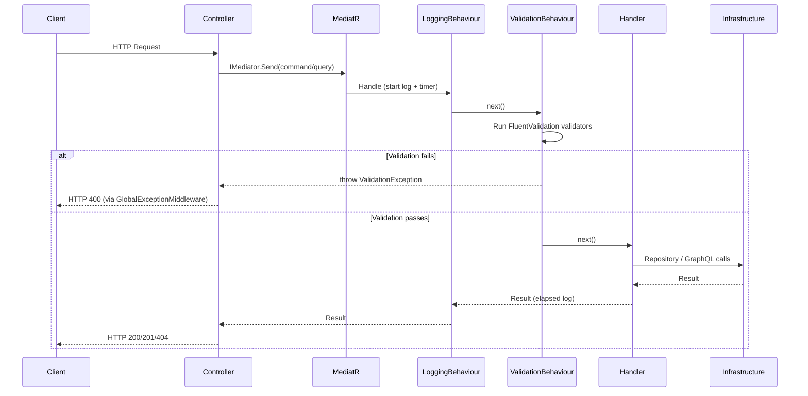
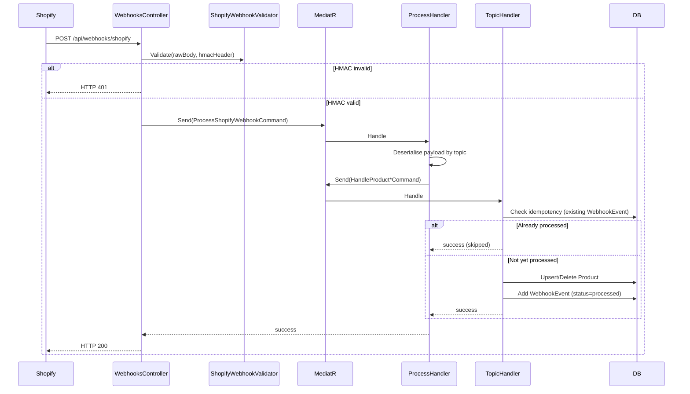

# Design Document: CQRS/MediatR Refactor

## Overview

This document describes the technical design for refactoring the ShopifyIntegration ASP.NET Core application from a service-based architecture to a CQRS (Command Query Responsibility Segregation) architecture using MediatR. The refactor introduces a feature-based folder structure, thin controllers, FluentValidation pipeline integration, structured logging, and consistent error handling — while preserving all existing infrastructure (EF Core, repositories, Shopify GraphQL client, HMAC validation, and database migrations) without modification.

The goal is to make every unit of business logic independently testable, observable, and auditable through a clean separation of Commands, Queries, and their Handlers.

### Key Design Decisions

- **MediatR as the in-process bus**: All controller-to-handler communication flows through `IMediator.Send`. No direct service injection in controllers.
- **Feature-based co-location**: Commands, Queries, Handlers, Validators, and response DTOs for a feature live together under `Features/{FeatureName}/`.
- **Pipeline behaviours for cross-cutting concerns**: Validation and logging are applied uniformly via `IPipelineBehavior<,>` — no per-handler boilerplate.
- **Webhook fan-out via nested dispatch**: `ProcessShopifyWebhookCommand` deserialises the payload and dispatches a topic-specific command via `IMediator.Send`, keeping each handler focused on a single topic.
- **Idempotency at the handler level**: Each webhook handler checks for an existing processed `WebhookEvent` before writing, preventing duplicate processing.
- **`IShopifyGraphQLService` interface extraction**: The concrete `ShopifyGraphQLService` is hidden behind a new interface so handlers depend on the abstraction.

---

## Architecture

The application is reorganised into four logical layers. These are not separate projects — they are folder-level conventions within the single `ShopifyIntegration` project.

```
ShopifyIntegration/
├── API/
│   └── Controllers/
│       ├── ProductsController.cs
│       └── WebhooksController.cs
├── Features/
│   ├── Products/
│   │   ├── Commands/
│   │   │   ├── CreateProductCommand.cs
│   │   │   ├── CreateProductCommandHandler.cs
│   │   │   ├── CreateProductCommandValidator.cs
│   │   │   ├── UpdateProductCommand.cs
│   │   │   ├── UpdateProductCommandHandler.cs
│   │   │   ├── UpdateProductCommandValidator.cs
│   │   │   ├── DeleteProductCommand.cs
│   │   │   ├── DeleteProductCommandHandler.cs
│   │   │   └── DeleteProductCommandValidator.cs
│   │   └── Queries/
│   │       ├── GetProductsQuery.cs
│   │       ├── GetProductsQueryHandler.cs
│   │       ├── GetProductByIdQuery.cs
│   │       └── GetProductByIdQueryHandler.cs
│   └── Webhooks/
│       ├── Commands/
│       │   ├── ProcessShopifyWebhookCommand.cs
│       │   ├── ProcessShopifyWebhookCommandHandler.cs
│       │   ├── ProcessShopifyWebhookCommandValidator.cs
│       │   ├── HandleProductCreatedCommand.cs
│       │   ├── HandleProductCreatedCommandHandler.cs
│       │   ├── HandleProductUpdatedCommand.cs
│       │   ├── HandleProductUpdatedCommandHandler.cs
│       │   ├── HandleProductDeletedCommand.cs
│       │   └── HandleProductDeletedCommandHandler.cs
│       └── Models/
│           ├── ProductCreatedWebhook.cs   (moved from Webhooks/Models/Products/)
│           ├── ProductUpdatedWebhook.cs
│           └── ProductDeletedWebhook.cs
├── Domain/
│   ├── Entities/
│   │   ├── Product.cs                    (moved from Data/Entities/)
│   │   └── WebhookEvent.cs
│   └── Repositories/
│       ├── IProductRepository.cs         (moved from Data/Repositories/)
│       └── IWebhookEventRepository.cs
├── Infrastructure/
│   ├── Data/
│   │   ├── ShopifyDbContext.cs
│   │   ├── Configurations/
│   │   │   ├── ProductConfiguration.cs
│   │   │   └── WebhookEventConfiguration.cs
│   │   ├── Repositories/
│   │   │   ├── ProductRepository.cs
│   │   │   └── WebhookEventRepository.cs
│   │   └── Helpers/
│   │       └── ShopifyGidHelper.cs
│   └── Shopify/
│       ├── IShopifyGraphQLService.cs     (new interface)
│       ├── ShopifyGraphQLService.cs
│       └── Validators/
│           └── ShopifyWebhookValidator.cs
├── Pipeline/
│   ├── ValidationBehaviour.cs
│   └── LoggingBehaviour.cs
├── Middleware/
│   └── GlobalExceptionMiddleware.cs
├── Models/
│   └── ShopifySettings.cs
├── Migrations/                           (unchanged)
├── Program.cs
└── ShopifyIntegration.csproj
```

### Request Flow



### Webhook Processing Flow



---

## Components and Interfaces

### Pipeline Behaviours

#### `ValidationBehaviour<TRequest, TResponse>`

```csharp
public sealed class ValidationBehaviour<TRequest, TResponse>
    : IPipelineBehavior<TRequest, TResponse>
    where TRequest : IRequest<TResponse>
{
    private readonly IEnumerable<IValidator<TRequest>> _validators;

    public ValidationBehaviour(IEnumerable<IValidator<TRequest>> validators)
        => _validators = validators;

    public async Task<TResponse> Handle(
        TRequest request,
        RequestHandlerDelegate<TResponse> next,
        CancellationToken cancellationToken)
    {
        if (!_validators.Any()) return await next();

        var context = new ValidationContext<TRequest>(request);
        var failures = _validators
            .Select(v => v.Validate(context))
            .SelectMany(r => r.Errors)
            .Where(f => f is not null)
            .ToList();

        if (failures.Count > 0)
            throw new ValidationException(failures);

        return await next();
    }
}
```

#### `LoggingBehaviour<TRequest, TResponse>`

```csharp
public sealed class LoggingBehaviour<TRequest, TResponse>
    : IPipelineBehavior<TRequest, TResponse>
    where TRequest : IRequest<TResponse>
{
    private readonly ILogger<LoggingBehaviour<TRequest, TResponse>> _logger;

    public LoggingBehaviour(ILogger<LoggingBehaviour<TRequest, TResponse>> logger)
        => _logger = logger;

    public async Task<TResponse> Handle(
        TRequest request,
        RequestHandlerDelegate<TResponse> next,
        CancellationToken cancellationToken)
    {
        var requestName = typeof(TRequest).Name;
        var correlationId = Guid.NewGuid();
        _logger.LogInformation(
            "[{CorrelationId}] Handling {RequestName}", correlationId, requestName);

        var sw = Stopwatch.StartNew();
        try
        {
            var response = await next();
            sw.Stop();
            _logger.LogInformation(
                "[{CorrelationId}] Handled {RequestName} in {ElapsedMs}ms",
                correlationId, requestName, sw.ElapsedMilliseconds);
            return response;
        }
        catch (Exception ex)
        {
            sw.Stop();
            _logger.LogError(ex,
                "[{CorrelationId}] {RequestName} failed after {ElapsedMs}ms",
                correlationId, requestName, sw.ElapsedMilliseconds);
            throw;
        }
    }
}
```

### `IShopifyGraphQLService` Interface (new)

Extracted from the concrete `ShopifyGraphQLService` so handlers depend on the abstraction:

```csharp
public interface IShopifyGraphQLService
{
    Task<CreateProductResponse?> CreateProductAsync(
        CreateProductGraphQLDto dto, CancellationToken ct = default);
    Task<GetProductsResponse?> GetProductsAsync(CancellationToken ct = default);
    Task<UpdateProductResponse?> UpdateProductAsync(
        UpdateProductGraphQLDto dto, CancellationToken ct = default);
    Task<DeleteProductResponse?> DeleteProductAsync(
        string productId, CancellationToken ct = default);
}
```

### `IWebhookEventRepository` Extension

The existing interface gains one method to support idempotency checks:

```csharp
public interface IWebhookEventRepository
{
    Task<WebhookEvent> AddAsync(WebhookEvent webhookEvent, CancellationToken ct = default);
    Task<List<WebhookEvent>> GetByTopicAsync(string topic, CancellationToken ct = default);

    // New: idempotency check
    Task<bool> ExistsProcessedAsync(
        string topic, long shopifyNumericId, CancellationToken ct = default);
}
```

### Controllers

#### `ProductsController`

Thin dispatcher — `IMediator` is the only injected dependency:

```csharp
[ApiController]
[Route("api/products")]
public sealed class ProductsController : ControllerBase
{
    private readonly IMediator _mediator;
    public ProductsController(IMediator mediator) => _mediator = mediator;

    [HttpPost]
    public async Task<IActionResult> CreateProduct(
        CreateProductCommand command, CancellationToken ct)
        => Ok(await _mediator.Send(command, ct));

    [HttpGet]
    public async Task<IActionResult> GetProducts(CancellationToken ct)
        => Ok(await _mediator.Send(new GetProductsQuery(), ct));

    [HttpGet("{gid}")]
    public async Task<IActionResult> GetProductById(
        string gid, CancellationToken ct)
    {
        var result = await _mediator.Send(new GetProductByIdQuery(gid), ct);
        return result is null ? NotFound() : Ok(result);
    }

    [HttpPut]
    public async Task<IActionResult> UpdateProduct(
        UpdateProductCommand command, CancellationToken ct)
        => Ok(await _mediator.Send(command, ct));

    [HttpDelete]
    public async Task<IActionResult> DeleteProduct(
        [FromQuery] string gid, CancellationToken ct)
        => Ok(await _mediator.Send(new DeleteProductCommand(gid), ct));
}
```

#### `WebhooksController`

HMAC validation remains in the controller (pre-dispatch guard), then dispatches `ProcessShopifyWebhookCommand`:

```csharp
[ApiController]
[Route("api/webhooks")]
public sealed class WebhooksController : ControllerBase
{
    private readonly IMediator _mediator;
    private readonly IShopifyWebhookValidator _validator;

    public WebhooksController(IMediator mediator, IShopifyWebhookValidator validator)
    {
        _mediator  = mediator;
        _validator = validator;
    }

    [HttpPost("shopify")]
    public async Task<IActionResult> ReceiveShopifyWebhook(CancellationToken ct)
    {
        if (!Request.Headers.TryGetValue("X-Shopify-Hmac-SHA256", out var hmacValues)
            || string.IsNullOrEmpty(hmacValues))
            return BadRequest();

        if (!Request.Headers.TryGetValue("X-Shopify-Topic", out var topicValues)
            || string.IsNullOrEmpty(topicValues))
            return BadRequest();

        using var ms = new MemoryStream();
        await Request.Body.CopyToAsync(ms, ct);
        var rawBody = ms.ToArray();

        var validation = _validator.Validate(rawBody, hmacValues.ToString());
        if (!validation.IsValid)
            return Unauthorized();

        await _mediator.Send(
            new ProcessShopifyWebhookCommand(rawBody, topicValues.ToString()), ct);
        return Ok();
    }
}
```

> **Note**: `WebhooksController` retains `IShopifyWebhookValidator` as a second dependency. This is intentional — HMAC validation is a security gate that must run before any MediatR dispatch, so it cannot be moved into a pipeline behaviour (which runs after dispatch).

---

## Data Models

### Commands

```csharp
// Product Commands
public sealed record CreateProductCommand(
    string Title, string DescriptionHtml, string Vendor)
    : IRequest<CreateProductResponse?>;

public sealed record UpdateProductCommand(
    string ShopifyGid, string Title, string DescriptionHtml)
    : IRequest<UpdateProductResponse?>;

public sealed record DeleteProductCommand(string ShopifyGid)
    : IRequest<DeleteProductResponse?>;

// Webhook Commands
public sealed record ProcessShopifyWebhookCommand(byte[] RawBody, string Topic)
    : IRequest<Unit>;

public sealed record HandleProductCreatedCommand(
    long NumericId, string Title, string Vendor, string Status, DateTimeOffset UpdatedAt)
    : IRequest<Unit>;

public sealed record HandleProductUpdatedCommand(
    long NumericId, string Title, string Vendor, string Status, DateTimeOffset UpdatedAt)
    : IRequest<Unit>;

public sealed record HandleProductDeletedCommand(long NumericId)
    : IRequest<Unit>;
```

### Queries

```csharp
public sealed record GetProductsQuery() : IRequest<GetProductsResponse?>;

public sealed record GetProductByIdQuery(string ShopifyGid)
    : IRequest<Product?>;
```

### Domain Entities (unchanged)

`Product` and `WebhookEvent` entities remain structurally identical. They are relocated from `Data/Entities/` to `Domain/Entities/` with namespace updates only.

### FluentValidation Validators

```csharp
public sealed class CreateProductCommandValidator
    : AbstractValidator<CreateProductCommand>
{
    public CreateProductCommandValidator()
    {
        RuleFor(x => x.Title).NotEmpty();
        RuleFor(x => x.Vendor).NotEmpty();
    }
}

public sealed class UpdateProductCommandValidator
    : AbstractValidator<UpdateProductCommand>
{
    public UpdateProductCommandValidator()
    {
        RuleFor(x => x.ShopifyGid).NotEmpty();
        RuleFor(x => x.Title).NotEmpty();
    }
}

public sealed class DeleteProductCommandValidator
    : AbstractValidator<DeleteProductCommand>
{
    public DeleteProductCommandValidator()
    {
        RuleFor(x => x.ShopifyGid).NotEmpty();
    }
}

public sealed class ProcessShopifyWebhookCommandValidator
    : AbstractValidator<ProcessShopifyWebhookCommand>
{
    public ProcessShopifyWebhookCommandValidator()
    {
        RuleFor(x => x.Topic).NotEmpty();
        RuleFor(x => x.RawBody).NotEmpty();
    }
}
```

### Global Exception Middleware

```csharp
public sealed class GlobalExceptionMiddleware
{
    private readonly RequestDelegate _next;
    private readonly ILogger<GlobalExceptionMiddleware> _logger;

    public GlobalExceptionMiddleware(
        RequestDelegate next,
        ILogger<GlobalExceptionMiddleware> logger)
    {
        _next   = next;
        _logger = logger;
    }

    public async Task InvokeAsync(HttpContext context)
    {
        try
        {
            await _next(context);
        }
        catch (ValidationException ex)
        {
            context.Response.StatusCode  = StatusCodes.Status400BadRequest;
            context.Response.ContentType = "application/json";
            var errors = ex.Errors.Select(e => e.ErrorMessage);
            await context.Response.WriteAsJsonAsync(new { errors });
        }
        catch (Exception ex)
        {
            _logger.LogError(ex, "Unhandled exception");
            context.Response.StatusCode  = StatusCodes.Status500InternalServerError;
            context.Response.ContentType = "application/json";
            await context.Response.WriteAsJsonAsync(
                new { error = "An unexpected error occurred." });
        }
    }
}
```

### DI Registration (`Program.cs` additions)

```csharp
// MediatR — scans assembly for all IRequestHandler implementations
builder.Services.AddMediatR(cfg =>
    cfg.RegisterServicesFromAssembly(typeof(Program).Assembly));

// Pipeline behaviours (order matters: logging wraps validation)
builder.Services.AddTransient(
    typeof(IPipelineBehavior<,>), typeof(LoggingBehaviour<,>));
builder.Services.AddTransient(
    typeof(IPipelineBehavior<,>), typeof(ValidationBehaviour<,>));

// FluentValidation — scans assembly for all AbstractValidator<T> implementations
builder.Services.AddValidatorsFromAssembly(typeof(Program).Assembly);

// IShopifyGraphQLService (new interface)
builder.Services.AddScoped<IShopifyGraphQLService, ShopifyGraphQLService>();

// Global exception middleware
app.UseMiddleware<GlobalExceptionMiddleware>();

// Remove: IShopifyWebhookService (replaced by CQRS handlers)
// Remove: ShopifyService (REST legacy, no longer referenced)
```

---

## Correctness Properties

*A property is a characteristic or behavior that should hold true across all valid executions of a system — essentially, a formal statement about what the system should do. Properties serve as the bridge between human-readable specifications and machine-verifiable correctness guarantees.*

### Property 1: ValidationBehaviour rejects invalid commands before the handler runs

*For any* Command or Query that fails FluentValidation rules (e.g., empty required fields), the `ValidationBehaviour` SHALL throw a `ValidationException` and the handler SHALL NOT be invoked.

**Validates: Requirements 1.4, 9.5**

### Property 2: HMAC rejection is universal

*For any* raw webhook body and any HMAC header value that does not match the HMAC-SHA256 of that body under the configured secret, the `WebhooksController` SHALL return HTTP 401 and SHALL NOT dispatch a `ProcessShopifyWebhookCommand`.

**Validates: Requirements 3.6, 7.4**

### Property 3: Query handlers perform no writes

*For any* `GetProductsQuery` or `GetProductByIdQuery` dispatched through the pipeline, no write methods (`UpsertAsync`, `DeleteByNumericIdAsync`, `AddAsync`) on any repository SHALL be invoked.

**Validates: Requirements 5.6**

### Property 4: ProcessShopifyWebhookCommand dispatches the correct topic-specific command

*For any* recognised webhook topic (`products/create`, `products/update`, `products/delete`), the `ProcessShopifyWebhookCommandHandler` SHALL dispatch exactly the corresponding topic-specific command (`HandleProductCreatedCommand`, `HandleProductUpdatedCommand`, `HandleProductDeletedCommand`) and SHALL NOT dispatch commands for other topics.

**Validates: Requirements 6.2**

### Property 5: Webhook handlers are idempotent

*For any* `HandleProductCreatedCommand`, `HandleProductUpdatedCommand`, or `HandleProductDeletedCommand` where a `WebhookEvent` with matching topic and `ShopifyNumericId` and status `"processed"` already exists, the handler SHALL NOT call `UpsertAsync` or `DeleteByNumericIdAsync` on the product repository.

**Validates: Requirements 8.2, 8.3**

### Property 6: Failed webhook handlers record a "failed" event and re-throw

*For any* exception thrown by the product repository during webhook command handling, the handler SHALL record a `WebhookEvent` with status `"failed"` containing the exception message, and SHALL re-throw the original exception.

**Validates: Requirements 6.10**

### Property 7: ValidationException maps to HTTP 400

*For any* `ValidationException` propagated through the `GlobalExceptionMiddleware`, the HTTP response status SHALL be 400 and the response body SHALL contain the validation failure messages as JSON.

**Validates: Requirements 9.6, 10.5**

---

## Error Handling

### Validation Errors (HTTP 400)

`ValidationBehaviour` collects all `FluentValidation` failures and throws a `ValidationException`. `GlobalExceptionMiddleware` catches this and returns:

```json
{
  "errors": ["Title must not be empty.", "Vendor must not be empty."]
}
```

### Not Found (HTTP 404)

`GetProductByIdQueryHandler` returns `null` when the product is not in the database. `ProductsController` maps `null` to `NotFound()`. No exception is thrown.

### Shopify GraphQL Errors (HTTP 500)

If `IShopifyGraphQLService` returns a response with `UserErrors`, the handler throws a `ShopifyOperationException` (a domain exception). `GlobalExceptionMiddleware` catches unhandled exceptions and returns HTTP 500:

```json
{
  "error": "An unexpected error occurred."
}
```

Detailed error information is logged by `LoggingBehaviour` before the exception propagates.

### Webhook Failures

If an exception occurs inside a webhook topic handler:
1. The handler records a `WebhookEvent` with `Status = "failed"` and `ErrorMessage = ex.Message`.
2. The handler re-throws.
3. `LoggingBehaviour` logs the exception at Error level.
4. `GlobalExceptionMiddleware` returns HTTP 500.

Shopify will retry the webhook delivery on a 5xx response, which is the desired behaviour.

### Unknown Webhook Topics

`ProcessShopifyWebhookCommandHandler` records a `WebhookEvent` with `Status = "skipped"` and returns `Unit.Value` (success). The controller returns HTTP 200, which tells Shopify not to retry.

---

## Testing Strategy

### NuGet Packages Required

```xml
<PackageReference Include="MediatR" Version="12.*" />
<PackageReference Include="FluentValidation.AspNetCore" Version="11.*" />
```

### Unit Tests

Unit tests cover specific examples, edge cases, and error conditions. Each handler is tested in isolation with mocked dependencies.

**Handler tests** (using `Moq` or `NSubstitute`):
- `CreateProductCommandHandler`: verify `IShopifyGraphQLService.CreateProductAsync` and `IProductRepository.UpsertAsync` are called with correct arguments.
- `GetProductByIdQueryHandler`: verify `IProductRepository.GetByShopifyGidAsync` is called; verify `null` is returned when not found.
- `ProcessShopifyWebhookCommandHandler`: verify correct sub-command is dispatched per topic; verify `WebhookEvent` with `"skipped"` is recorded for unknown topics.
- `HandleProductCreatedCommandHandler`: verify idempotency check; verify upsert is skipped when already processed.

**Validator tests**:
- `CreateProductCommandValidator`: empty title → fails; empty vendor → fails; both populated → passes.
- `UpdateProductCommandValidator`: empty GID → fails; empty title → fails.
- `DeleteProductCommandValidator`: empty GID → fails.
- `ProcessShopifyWebhookCommandValidator`: empty topic → fails; empty body → fails.

**Middleware tests**:
- `GlobalExceptionMiddleware`: `ValidationException` → HTTP 400 with errors JSON; generic exception → HTTP 500.

### Property-Based Tests

Property-based testing is applied using **FsCheck** (the standard PBT library for .NET). Each property test runs a minimum of **100 iterations**.

Tag format: `// Feature: cqrs-mediatr-refactor, Property {N}: {property_text}`

**Property 1** — ValidationBehaviour rejects invalid commands:
Generate random `CreateProductCommand` instances with at least one empty required field. Assert `ValidationException` is thrown and the mock handler is never called.

**Property 2** — HMAC rejection is universal:
Generate random byte arrays as the body and random strings as the HMAC header (excluding the correct HMAC). Assert the controller returns HTTP 401 and `IMediator.Send` is never called.

**Property 3** — Query handlers perform no writes:
Generate random `GetProductsQuery` and `GetProductByIdQuery` inputs. Assert no write methods are called on the mocked `IProductRepository`.

**Property 4** — ProcessShopifyWebhookCommand dispatches correct sub-command:
Generate random payloads for each of the three recognised topics. Assert the correct `Handle*Command` type is dispatched via the mocked `IMediator`.

**Property 5** — Webhook handlers are idempotent:
Generate random `HandleProduct*Command` inputs. Configure the mocked `IWebhookEventRepository.ExistsProcessedAsync` to return `true`. Assert `IProductRepository.UpsertAsync` and `DeleteByNumericIdAsync` are never called.

**Property 6** — Failed webhook handlers record "failed" and re-throw:
Generate random exceptions from the mocked `IProductRepository`. Assert `IWebhookEventRepository.AddAsync` is called with `Status = "failed"` and the exception is re-thrown.

**Property 7** — ValidationException maps to HTTP 400:
Generate random `ValidationException` instances with varying failure messages. Assert `GlobalExceptionMiddleware` returns HTTP 400 and the response body contains all failure messages.

### Integration Tests

Integration tests verify end-to-end wiring with a real in-memory or test database:
- DI container resolves `IMediator`, all handlers, and all validators without errors.
- `ValidationBehaviour` is in the pipeline and fires before handlers.
- `LoggingBehaviour` is in the pipeline and logs start/end.
- `GlobalExceptionMiddleware` is registered and intercepts unhandled exceptions.
