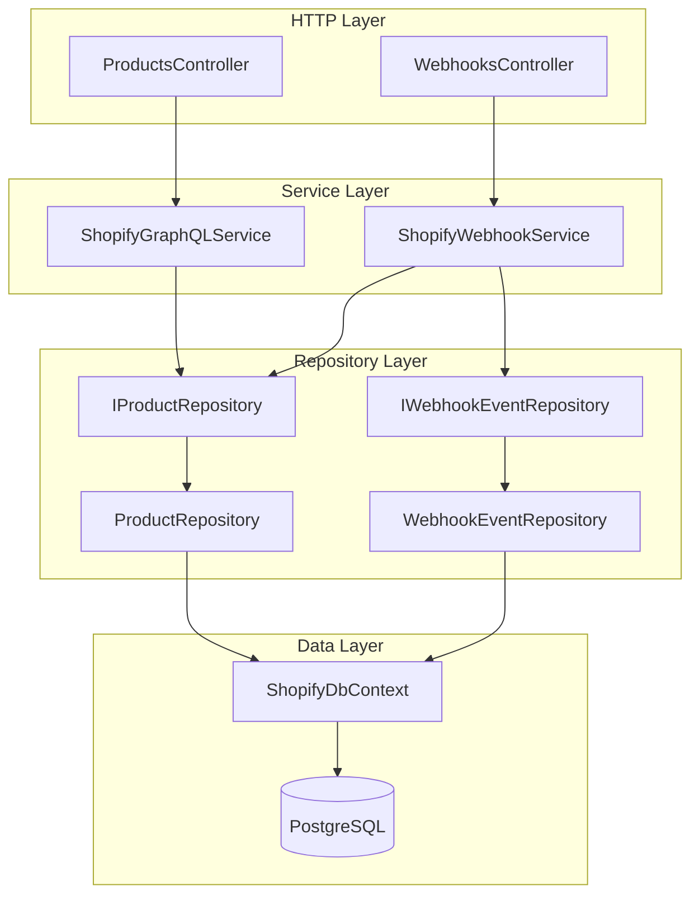

# Design Document: Database Integration

## Overview

This design introduces a PostgreSQL persistence layer to the existing Shopify integration application using Entity Framework Core with the Npgsql provider. The goal is to durably store product data and webhook events without altering the observable HTTP behaviour of any existing endpoint.

The approach follows the repository pattern: a `ShopifyDbContext` owns the EF Core mappings, two repository interfaces (`IProductRepository`, `IWebhookEventRepository`) expose the data-access operations, and the two existing services (`ShopifyGraphQLService`, `ShopifyWebhookService`) are updated to call those repositories after each successful Shopify API interaction or webhook receipt.

Migrations are applied automatically at startup before the HTTP server begins accepting requests, so the schema is always in sync with the running code.

---

## Architecture



Key design decisions:

- **Repository pattern over direct DbContext injection** — services depend on interfaces, making them testable with mocks without a real database.
- **Upsert via EF Core `ExecuteUpdate` / `Add`** — avoids a separate read-then-write round trip for the common create/update path.
- **Startup migration runner** — a small `IHostedService` (or inline `app.Services` call in `Program.cs`) applies pending migrations before `app.Run()`, keeping the migration concern out of the request pipeline.
- **Npgsql execution strategy** — configured at `DbContext` registration time; retries up to 3 times with exponential back-off capped at 30 seconds.

---

## Components and Interfaces

### ShopifyDbContext

```csharp
// ShopifyIntegration/Data/ShopifyDbContext.cs
public sealed class ShopifyDbContext : DbContext
{
    public ShopifyDbContext(DbContextOptions<ShopifyDbContext> options)
        : base(options) { }

    public DbSet<Product>      Products      { get; set; } = null!;
    public DbSet<WebhookEvent> WebhookEvents { get; set; } = null!;

    protected override void OnModelCreating(ModelBuilder modelBuilder)
    {
        modelBuilder.ApplyConfigurationsFromAssembly(typeof(ShopifyDbContext).Assembly);
    }
}
```

### IProductRepository

```csharp
// ShopifyIntegration/Data/Repositories/IProductRepository.cs
public interface IProductRepository
{
    Task<Product>   UpsertAsync(Product product, CancellationToken ct = default);
    Task<Product?>  GetByShopifyGidAsync(string shopifyGid, CancellationToken ct = default);
    Task<Product?>  GetByNumericIdAsync(long numericId, CancellationToken ct = default);
    Task<bool>      DeleteByNumericIdAsync(long numericId, CancellationToken ct = default);
    Task<List<Product>> GetAllAsync(CancellationToken ct = default);
}
```

### ProductRepository

```csharp
// ShopifyIntegration/Data/Repositories/ProductRepository.cs
public sealed class ProductRepository : IProductRepository
{
    private readonly ShopifyDbContext _db;
    private readonly ILogger<ProductRepository> _logger;

    public ProductRepository(ShopifyDbContext db, ILogger<ProductRepository> logger)
    {
        _db     = db;
        _logger = logger;
    }

    public async Task<Product> UpsertAsync(Product product, CancellationToken ct = default)
    {
        var existing = await _db.Products
            .FirstOrDefaultAsync(p => p.ShopifyGid == product.ShopifyGid, ct);

        if (existing is null)
        {
            _db.Products.Add(product);
        }
        else
        {
            existing.Title     = product.Title;
            existing.Vendor    = product.Vendor;
            existing.Status    = product.Status;
            existing.UpdatedAt = product.UpdatedAt;
        }

        await _db.SaveChangesAsync(ct);
        return existing ?? product;
    }

    public Task<Product?> GetByShopifyGidAsync(string shopifyGid, CancellationToken ct = default)
        => _db.Products.FirstOrDefaultAsync(p => p.ShopifyGid == shopifyGid, ct);

    public Task<Product?> GetByNumericIdAsync(long numericId, CancellationToken ct = default)
        => _db.Products.FirstOrDefaultAsync(p => p.NumericId == numericId, ct);

    public async Task<bool> DeleteByNumericIdAsync(long numericId, CancellationToken ct = default)
    {
        var rows = await _db.Products
            .Where(p => p.NumericId == numericId)
            .ExecuteDeleteAsync(ct);
        return rows > 0;
    }

    public Task<List<Product>> GetAllAsync(CancellationToken ct = default)
        => _db.Products.ToListAsync(ct);
}
```

### IWebhookEventRepository

```csharp
// ShopifyIntegration/Data/Repositories/IWebhookEventRepository.cs
public interface IWebhookEventRepository
{
    Task<WebhookEvent>       AddAsync(WebhookEvent webhookEvent, CancellationToken ct = default);
    Task<List<WebhookEvent>> GetByTopicAsync(string topic, CancellationToken ct = default);
}
```

### WebhookEventRepository

```csharp
// ShopifyIntegration/Data/Repositories/WebhookEventRepository.cs
public sealed class WebhookEventRepository : IWebhookEventRepository
{
    private readonly ShopifyDbContext _db;

    public WebhookEventRepository(ShopifyDbContext db) => _db = db;

    public async Task<WebhookEvent> AddAsync(WebhookEvent webhookEvent, CancellationToken ct = default)
    {
        _db.WebhookEvents.Add(webhookEvent);
        await _db.SaveChangesAsync(ct);
        return webhookEvent;
    }

    public Task<List<WebhookEvent>> GetByTopicAsync(string topic, CancellationToken ct = default)
        => _db.WebhookEvents.Where(e => e.Topic == topic).ToListAsync(ct);
}
```

### Updated ShopifyGraphQLService (relevant changes)

`ShopifyGraphQLService` gains an `IProductRepository` constructor parameter. After each successful Shopify API call it calls the repository:

```csharp
// After CreateProductAsync succeeds:
if (response?.ProductCreate?.Product is { } p)
{
    var entity = MapToEntity(p);
    await _productRepository.UpsertAsync(entity, ct);
}

// After UpdateProductAsync succeeds:
if (response?.ProductUpdate?.Product is { } p)
{
    var entity = MapToEntity(p);
    await _productRepository.UpsertAsync(entity, ct);
}

// After DeleteProductAsync succeeds:
var numericId = ParseNumericId(productId);
await _productRepository.DeleteByNumericIdAsync(numericId, ct);
```

A private helper `ParseNumericId(string gid)` extracts the trailing numeric segment from a Shopify GID string (`gid://shopify/Product/{numericId}`).

### Updated ShopifyWebhookService (relevant changes)

`ShopifyWebhookService` gains `IProductRepository` and `IWebhookEventRepository` constructor parameters. The switch expression is replaced with async methods that persist before returning:

```csharp
"products/create" => await HandleCreateAsync(json, rawPayload),
"products/update" => await HandleUpdateAsync(json, rawPayload),
"products/delete" => await HandleDeleteAsync(json, rawPayload),
_                 => await HandleUnknownAsync(topic, rawPayload)
```

On any exception the catch block records a `WebhookEvent` with `status = "failed"` and `error_message` set to the exception message before returning `WebhookResult.Failure`.

### DI Registration (Program.cs additions)

```csharp
// Validate connection string at startup
var connectionString = builder.Configuration.GetConnectionString("DefaultConnection");
if (string.IsNullOrWhiteSpace(connectionString))
    throw new InvalidOperationException(
        "ConnectionStrings:DefaultConnection is missing or empty. " +
        "Set it in appsettings.json or an environment variable.");

builder.Services.AddDbContext<ShopifyDbContext>(options =>
    options.UseNpgsql(connectionString, npgsql =>
        npgsql.EnableRetryOnFailure(
            maxRetryCount: 3,
            maxRetryDelay: TimeSpan.FromSeconds(30),
            errorCodesToAdd: null)));

builder.Services.AddScoped<IProductRepository, ProductRepository>();
builder.Services.AddScoped<IWebhookEventRepository, WebhookEventRepository>();
```

### Startup Migration Runner (Program.cs, after `var app = builder.Build()`)

```csharp
using (var scope = app.Services.CreateScope())
{
    var db     = scope.ServiceProvider.GetRequiredService<ShopifyDbContext>();
    var logger = scope.ServiceProvider.GetRequiredService<ILogger<Program>>();
    try
    {
        await db.Database.MigrateAsync();
    }
    catch (Exception ex)
    {
        logger.LogCritical(ex, "Database migration failed. Application will terminate.");
        Environment.Exit(1);
    }
}
```

---

## Data Models

### Product Entity

```csharp
// ShopifyIntegration/Data/Entities/Product.cs
public sealed class Product
{
    public int            Id         { get; set; }          // PK, auto-increment
    public string         ShopifyGid { get; set; } = "";    // unique, not null
    public long           NumericId  { get; set; }          // not null
    public string         Title      { get; set; } = "";    // not null
    public string         Vendor     { get; set; } = "";    // not null
    public string         Status     { get; set; } = "";    // not null
    public DateTimeOffset CreatedAt  { get; set; }          // timestamptz, not null
    public DateTimeOffset UpdatedAt  { get; set; }          // timestamptz, not null
}
```

EF Core configuration (IEntityTypeConfiguration):

```csharp
// ShopifyIntegration/Data/Configurations/ProductConfiguration.cs
public sealed class ProductConfiguration : IEntityTypeConfiguration<Product>
{
    public void Configure(EntityTypeBuilder<Product> builder)
    {
        builder.ToTable("products");
        builder.HasKey(p => p.Id);
        builder.Property(p => p.Id).HasColumnName("id").UseIdentityAlwaysColumn();
        builder.Property(p => p.ShopifyGid).HasColumnName("shopify_gid").IsRequired();
        builder.Property(p => p.NumericId).HasColumnName("numeric_id").IsRequired();
        builder.Property(p => p.Title).HasColumnName("title").IsRequired();
        builder.Property(p => p.Vendor).HasColumnName("vendor").IsRequired();
        builder.Property(p => p.Status).HasColumnName("status").IsRequired();
        builder.Property(p => p.CreatedAt).HasColumnName("created_at").IsRequired();
        builder.Property(p => p.UpdatedAt).HasColumnName("updated_at").IsRequired();
        builder.HasIndex(p => p.ShopifyGid).IsUnique();
    }
}
```

### WebhookEvent Entity

```csharp
// ShopifyIntegration/Data/Entities/WebhookEvent.cs
public sealed class WebhookEvent
{
    public int            Id               { get; set; }       // PK, auto-increment
    public string         Topic            { get; set; } = ""; // not null
    public long?          ShopifyNumericId { get; set; }       // nullable bigint
    public string         RawPayload       { get; set; } = ""; // not null
    public DateTimeOffset ProcessedAt      { get; set; }       // timestamptz, not null
    public string         Status           { get; set; } = ""; // not null ("processed"|"failed"|"skipped")
    public string?        ErrorMessage     { get; set; }       // nullable
}
```

EF Core configuration:

```csharp
// ShopifyIntegration/Data/Configurations/WebhookEventConfiguration.cs
public sealed class WebhookEventConfiguration : IEntityTypeConfiguration<WebhookEvent>
{
    public void Configure(EntityTypeBuilder<WebhookEvent> builder)
    {
        builder.ToTable("webhook_events");
        builder.HasKey(e => e.Id);
        builder.Property(e => e.Id).HasColumnName("id").UseIdentityAlwaysColumn();
        builder.Property(e => e.Topic).HasColumnName("topic").IsRequired();
        builder.Property(e => e.ShopifyNumericId).HasColumnName("shopify_numeric_id");
        builder.Property(e => e.RawPayload).HasColumnName("raw_payload").IsRequired();
        builder.Property(e => e.ProcessedAt).HasColumnName("processed_at").IsRequired();
        builder.Property(e => e.Status).HasColumnName("status").IsRequired();
        builder.Property(e => e.ErrorMessage).HasColumnName("error_message");
    }
}
```

### GID Helper

```csharp
// ShopifyIntegration/Data/Helpers/ShopifyGidHelper.cs
public static class ShopifyGidHelper
{
    // Parses "gid://shopify/Product/123456789" → 123456789
    public static long ParseNumericId(string gid)
    {
        var lastSlash = gid.LastIndexOf('/');
        if (lastSlash < 0 || !long.TryParse(gid[(lastSlash + 1)..], out var id))
            throw new FormatException($"Cannot parse numeric id from Shopify GID: '{gid}'");
        return id;
    }

    // Builds "gid://shopify/Product/123456789" from a numeric id
    public static string BuildProductGid(long numericId) =>
        $"gid://shopify/Product/{numericId}";
}
```

### appsettings.json addition

```json
"ConnectionStrings": {
  "DefaultConnection": "Host=localhost;Port=5432;Database=ShopifyDB;Username=<user>;Password=<password>"
}
```

The actual credentials are supplied via environment variables or user secrets and are never committed to source control.

---

## Correctness Properties

*A property is a characteristic or behavior that should hold true across all valid executions of a system — essentially, a formal statement about what the system should do. Properties serve as the bridge between human-readable specifications and machine-verifiable correctness guarantees.*

### Property 1: UpsertAsync inserts a new product and returns it with a generated id

*For any* valid `Product` instance whose `ShopifyGid` does not already exist in the database, calling `UpsertAsync` SHALL insert a new row and return an entity whose `Id` is greater than zero and whose `ShopifyGid`, `Title`, `Vendor`, `Status`, `NumericId`, `CreatedAt`, and `UpdatedAt` fields match the input.

**Validates: Requirements 4.2**

---

### Property 2: UpsertAsync updates mutable fields of an existing product

*For any* `Product` that already exists in the database (matched by `ShopifyGid`), calling `UpsertAsync` with modified `Title`, `Vendor`, `Status`, and `UpdatedAt` values SHALL update those fields on the existing row and return the updated entity, leaving the `Id`, `ShopifyGid`, `NumericId`, and `CreatedAt` fields unchanged.

**Validates: Requirements 4.3**

---

### Property 3: DeleteByNumericIdAsync returns true and removes an existing product

*For any* `Product` that exists in the database, calling `DeleteByNumericIdAsync` with its `NumericId` SHALL return `true` and the product SHALL no longer be retrievable via `GetByNumericIdAsync` or `GetByShopifyGidAsync`.

**Validates: Requirements 4.4**

---

### Property 4: DeleteByNumericIdAsync returns false for a non-existent product

*For any* `long` value that does not correspond to a `NumericId` in the database, calling `DeleteByNumericIdAsync` SHALL return `false` without throwing an exception.

**Validates: Requirements 4.5**

---

### Property 5: AddAsync inserts a WebhookEvent and returns it with a generated id

*For any* valid `WebhookEvent` instance, calling `AddAsync` SHALL insert a new row and return an entity whose `Id` is greater than zero and whose `Topic`, `RawPayload`, `Status`, `ProcessedAt`, `ShopifyNumericId`, and `ErrorMessage` fields match the input.

**Validates: Requirements 5.2**

---

### Property 6: ShopifyGraphQLService persists products on successful create or update

*For any* successful `CreateProductAsync` or `UpdateProductAsync` response that contains a non-null `ShopifyProduct`, the service SHALL call `IProductRepository.UpsertAsync` exactly once with a `Product` entity whose `ShopifyGid`, `Title`, and `Vendor` match the response data.

**Validates: Requirements 6.1, 6.2**

---

### Property 7: ShopifyGraphQLService removes product on successful delete

*For any* successful `DeleteProductAsync` call with a valid Shopify GID, the service SHALL call `IProductRepository.DeleteByNumericIdAsync` exactly once with the numeric id parsed from that GID.

**Validates: Requirements 6.3**

---

### Property 8: ShopifyWebhookService upserts product and records processed event for create/update topics

*For any* valid `products/create` or `products/update` payload, `ShopifyWebhookService.ProcessAsync` SHALL call `IProductRepository.UpsertAsync` with a `Product` entity matching the payload data, and call `IWebhookEventRepository.AddAsync` with a `WebhookEvent` whose `Status` is `"processed"` and `Topic` matches the input topic.

**Validates: Requirements 7.1, 7.2**

---

### Property 9: ShopifyWebhookService deletes product and records processed event for delete topic

*For any* valid `products/delete` payload, `ShopifyWebhookService.ProcessAsync` SHALL call `IProductRepository.DeleteByNumericIdAsync` with the numeric id from the payload, and call `IWebhookEventRepository.AddAsync` with a `WebhookEvent` whose `Status` is `"processed"`.

**Validates: Requirements 7.3**

---

### Property 10: ShopifyWebhookService records failed event and returns Failure on database exception

*For any* webhook topic and any exception thrown by either repository, `ShopifyWebhookService.ProcessAsync` SHALL call `IWebhookEventRepository.AddAsync` with a `WebhookEvent` whose `Status` is `"failed"` and `ErrorMessage` equals the exception's message, and SHALL return a `WebhookResult` where `IsSuccess` is `false`.

**Validates: Requirements 7.4**

---

### Property 11: ShopifyWebhookService records skipped event and returns Success for unknown topics

*For any* string that is not `"products/create"`, `"products/update"`, or `"products/delete"`, `ShopifyWebhookService.ProcessAsync` SHALL call `IWebhookEventRepository.AddAsync` with a `WebhookEvent` whose `Status` is `"skipped"`, and SHALL return a `WebhookResult` where `IsSuccess` is `true`.

**Validates: Requirements 7.5**

---

### Property 12: ShopifyGidHelper.ParseNumericId round-trips with BuildProductGid

*For any* positive `long` value, `ParseNumericId(BuildProductGid(n))` SHALL return `n`.

**Validates: Requirements 6.3** (correctness of the GID parsing used during delete)

---

## Error Handling

| Scenario | Behaviour |
|---|---|
| `ConnectionStrings:DefaultConnection` absent at startup | `InvalidOperationException` thrown in `Program.cs` before the DI container is built; application does not start |
| EF Core migration fails at startup | Exception caught, logged at `Critical` level, `Environment.Exit(1)` called |
| Transient PostgreSQL error during a request | Npgsql retry strategy retries up to 3 times with exponential back-off (max 30 s); if all retries fail, the final exception propagates to the caller |
| `ShopifyGraphQLService` repository call fails | Exception logged and re-thrown; the HTTP response will be a 500 |
| `ShopifyWebhookService` repository call fails | `WebhookEvent` with `status = "failed"` recorded (best-effort); `WebhookResult.Failure` returned; controller returns HTTP 500 |
| `ShopifyGidHelper.ParseNumericId` receives a malformed GID | `FormatException` thrown; callers are responsible for handling or logging |

---

## Testing Strategy

### NuGet packages to add (test project)

- `Microsoft.EntityFrameworkCore.InMemory` — for lightweight unit tests that need a real `DbContext` without PostgreSQL
- `FsCheck` or `FsCheck.Xunit` — property-based testing library for .NET
- `NSubstitute` — mocking framework for repository interfaces in service-layer tests

### Unit Tests (example-based)

- Verify `InvalidOperationException` is thrown when `ConnectionStrings:DefaultConnection` is absent (Requirement 1.2)
- Verify `ShopifyGraphQLService` logs and re-throws when `IProductRepository.UpsertAsync` throws (Requirement 6.4)
- Verify startup migration runner calls `Environment.Exit(1)` when `MigrateAsync` throws (Requirement 8.2)
- Verify `ShopifyGidHelper.ParseNumericId` throws `FormatException` for malformed GIDs

### Property-Based Tests (FsCheck)

Each property test runs a minimum of **100 iterations**. Each test is tagged with a comment in the format:

```
// Feature: database-integration, Property N: <property text>
```

| Property | What is generated | What is verified |
|---|---|---|
| 1 — UpsertAsync inserts | Random `Product` with unique `ShopifyGid` | Returned `Id > 0`; all fields match input |
| 2 — UpsertAsync updates | Random existing `Product` + random updated fields | Mutable fields updated; immutable fields unchanged |
| 3 — DeleteByNumericIdAsync returns true | Random existing `Product` | Returns `true`; product not found afterwards |
| 4 — DeleteByNumericIdAsync returns false | Random `long` not in DB | Returns `false`; no exception |
| 5 — AddAsync inserts WebhookEvent | Random `WebhookEvent` | Returned `Id > 0`; all fields match input |
| 6 — GraphQL service upserts on create/update | Random `ShopifyProduct` response data | `UpsertAsync` called once with matching entity |
| 7 — GraphQL service deletes on delete | Random Shopify GID strings | `DeleteByNumericIdAsync` called with correct numeric id |
| 8 — Webhook service upserts on create/update | Random `ProductCreatedWebhook` / `ProductUpdatedWebhook` JSON | `UpsertAsync` + `AddAsync(status="processed")` called |
| 9 — Webhook service deletes on delete | Random `ProductDeletedWebhook` JSON | `DeleteByNumericIdAsync` + `AddAsync(status="processed")` called |
| 10 — Webhook service records failure | Random topic + random exception | `AddAsync(status="failed", errorMessage=ex.Message)` called; result is Failure |
| 11 — Webhook service skips unknown topics | Random strings ∉ known topics | `AddAsync(status="skipped")` called; result is Success |
| 12 — GID round-trip | Random positive `long` | `ParseNumericId(BuildProductGid(n)) == n` |

Properties 1–5 use the EF Core InMemory provider so they run without a real database. Properties 6–11 use `NSubstitute` mocks for the repository interfaces.

### Integration Tests

- Apply migration to a real PostgreSQL test database and verify `products` and `webhook_events` tables exist with the correct columns and constraints (Requirements 2.1, 2.3, 3.1, 3.2)
- Verify the unique index on `products.shopify_gid` rejects duplicate inserts (Requirement 2.2)
- Verify the full startup migration path against a fresh database (Requirement 8.1)
