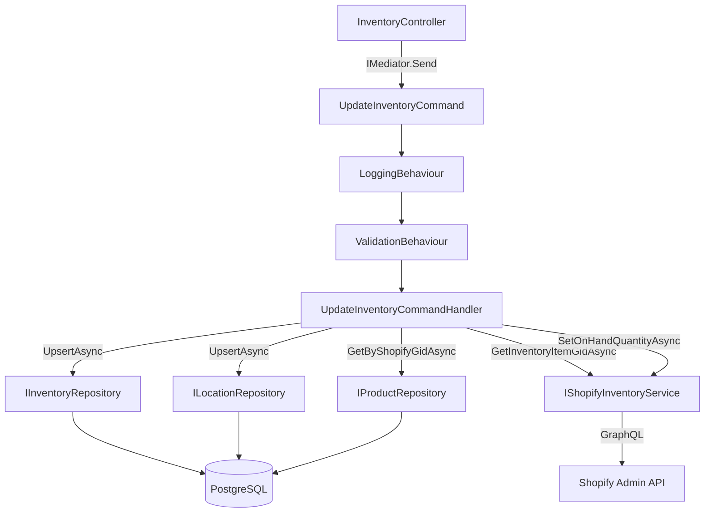

# Design Document — Inventory Update

## Overview

This feature adds inventory management to the existing Shopify integration. It introduces two new domain entities (`InventoryLevel` and `Location`), a dedicated `IShopifyInventoryService` for inventory-specific GraphQL operations, a new MediatR vertical slice (`UpdateInventoryCommand`), and a REST endpoint (`PATCH /api/stores/{storeId}/products/{productId}/inventory`).

The design follows every established pattern in the codebase: CQRS with MediatR, FluentValidation pipeline behaviour, EF Core with snake_case PostgreSQL column names, strongly-typed GraphQL response POCOs, and constructor-injected dependencies. No new libraries or architectural patterns are introduced.

### Key Design Decisions

- **Separate `IShopifyInventoryService`** rather than extending `IShopifyGraphQLService`. Inventory operations (resolving `InventoryItemGid`, calling `inventorySetOnHandQuantities`) are conceptually distinct from product CRUD. Keeping them in a dedicated interface keeps both interfaces focused and avoids growing `ShopifyGraphQLService` into a god class.
- **`ShopifyGidHelper` extended** with `BuildLocationGid` and `BuildInventoryItemGid` factory methods, consistent with the existing `BuildProductGid`.
- **Optimistic concurrency via `RowVersion`** on `InventoryLevel`. Inventory is a high-contention resource; a single retry on `DbUpdateConcurrencyException` is sufficient for the expected load.
- **`202 Accepted`** rather than `200 OK` for the inventory endpoint, because the update is propagated to an external system (Shopify) and the caller should treat it as an asynchronous side-effect.
- **`ShopifyInventoryException`** is a domain exception thrown when Shopify returns `userErrors`. The existing `GlobalExceptionMiddleware` is extended to map it to `502 Bad Gateway`.

---

## Architecture

The feature slots into the existing layered architecture without structural changes:

```
HTTP Request
    │
    ▼
InventoryController          (API layer)
    │  dispatches UpdateInventoryCommand via IMediator
    ▼
LoggingBehaviour             (Pipeline)
ValidationBehaviour          (Pipeline)
    │
    ▼
UpdateInventoryCommandHandler (Feature slice)
    │  ┌─────────────────────────────────────────────┐
    │  │ 1. Lookup Product in IProductRepository     │
    │  │ 2. GetInventoryItemGid via IShopifyInventory │
    │  │ 3. SetOnHandQuantity via IShopifyInventory   │
    │  │ 4. Upsert InventoryLevel in IInventoryRepo  │
    │  │ 5. Upsert Location in ILocationRepository   │
    │  └─────────────────────────────────────────────┘
    ▼
UpdateInventoryResult        (returned to controller → 202 Accepted)
```



---

## Components and Interfaces

### `ShopifyGidHelper` (extended)

Two new factory methods added to the existing static helper:

```csharp
public static string BuildLocationGid(long numericId) =>
    $"gid://shopify/Location/{numericId}";

public static string BuildInventoryItemGid(long numericId) =>
    $"gid://shopify/InventoryItem/{numericId}";
```

---

### `IShopifyInventoryService`

New interface in `ShopifyIntegration/Infrastructure/Shopify/`:

```csharp
public interface IShopifyInventoryService
{
    Task<string> GetInventoryItemGidAsync(string productGid, CancellationToken ct = default);
    Task<SetOnHandQuantityResponse?> SetOnHandQuantityAsync(
        string inventoryItemGid,
        string locationGid,
        int quantity,
        CancellationToken ct = default);
}
```

`ShopifyInventoryService` implements this interface, injecting `IConfiguration` and `ILogger<ShopifyInventoryService>`. It reuses the same `GraphService` pattern as `ShopifyGraphQLService`.

---

### GraphQL Queries and Mutations

**New query** in `ShopifyIntegration/GraphQL/Queries/InventoryQueries.cs`:

```csharp
public static class InventoryQueries
{
    public const string GetInventoryItemGid = @"
query getInventoryItemGid($id: ID!) {
  product(id: $id) {
    variants(first: 1) {
      edges {
        node {
          inventoryItem {
            id
          }
        }
      }
    }
  }
}";
}
```

**New mutation** in `ShopifyIntegration/GraphQL/Mutations/InventoryMutations.cs`:

```csharp
public static class InventoryMutations
{
    public const string SetOnHandQuantities = @"
mutation inventorySetOnHandQuantities($input: InventorySetOnHandQuantitiesInput!) {
  inventorySetOnHandQuantities(input: $input) {
    inventoryAdjustmentGroup {
      reason
      changes {
        name
        delta
        quantityAfterChange
        item {
          id
        }
        location {
          id
          name
        }
      }
    }
    userErrors {
      field
      message
      code
    }
  }
}";
}
```

---

### GraphQL Response POCOs

**`ShopifyIntegration/GraphQL/Responses/Inventory/`** (new folder):

```csharp
// GetInventoryItemGidResponse.cs
public class GetInventoryItemGidResponse
{
    public ShopifyProductVariants? Product { get; set; }
}

public class ShopifyProductVariants
{
    public ShopifyVariantConnection? Variants { get; set; }
}

public class ShopifyVariantConnection
{
    public List<ShopifyVariantEdge>? Edges { get; set; }
}

public class ShopifyVariantEdge
{
    public ShopifyVariantNode? Node { get; set; }
}

public class ShopifyVariantNode
{
    public ShopifyInventoryItemRef? InventoryItem { get; set; }
}

public class ShopifyInventoryItemRef
{
    public string? Id { get; set; }
}
```

```csharp
// SetOnHandQuantityResponse.cs
public class SetOnHandQuantityResponse
{
    public InventorySetOnHandPayload? InventorySetOnHandQuantities { get; set; }
}

public class InventorySetOnHandPayload
{
    public InventoryAdjustmentGroup? InventoryAdjustmentGroup { get; set; }
    public List<InventoryUserError>? UserErrors { get; set; }
}

public class InventoryAdjustmentGroup
{
    public string? Reason { get; set; }
    public List<InventoryChange>? Changes { get; set; }
}

public class InventoryChange
{
    public string? Name { get; set; }
    public int Delta { get; set; }
    public int QuantityAfterChange { get; set; }
    public ShopifyInventoryItemRef? Item { get; set; }
    public ShopifyLocationRef? Location { get; set; }
}

public class ShopifyLocationRef
{
    public string? Id { get; set; }
    public string? Name { get; set; }
}

public class InventoryUserError
{
    public List<string>? Field { get; set; }
    public string? Message { get; set; }
    public string? Code { get; set; }
}
```

---

### `ShopifyInventoryException`

New domain exception in `ShopifyIntegration/Infrastructure/Shopify/`:

```csharp
public sealed class ShopifyInventoryException : Exception
{
    public IReadOnlyList<string> ShopifyErrors { get; }

    public ShopifyInventoryException(IEnumerable<string> errors)
        : base($"Shopify inventory error(s): {string.Join("; ", errors)}")
    {
        ShopifyErrors = errors.ToList().AsReadOnly();
    }
}
```

`GlobalExceptionMiddleware` is extended to catch `ShopifyInventoryException` and return `502 Bad Gateway`.

---

### `UpdateInventoryCommand` and Result

**`ShopifyIntegration/Features/Inventory/Commands/UpdateInventoryCommand.cs`**:

```csharp
public sealed record UpdateInventoryCommand(
    string ProductGid,
    string LocationGid,
    int    Quantity,
    bool   Available = true)
    : IRequest<UpdateInventoryResult?>;
```

**`UpdateInventoryResult`**:

```csharp
public sealed record UpdateInventoryResult(
    string         ProductGid,
    string         LocationGid,
    string         InventoryItemGid,
    int            Quantity,
    bool           Available,
    DateTimeOffset UpdatedAt);
```

---

### `UpdateInventoryCommandValidator`

```csharp
public sealed class UpdateInventoryCommandValidator
    : AbstractValidator<UpdateInventoryCommand>
{
    public UpdateInventoryCommandValidator()
    {
        RuleFor(x => x.ProductGid).NotEmpty();
        RuleFor(x => x.LocationGid).NotEmpty();
        RuleFor(x => x.Quantity).GreaterThanOrEqualTo(0);
    }
}
```

---

### `UpdateInventoryCommandHandler`

Orchestration steps:

1. Look up the `Product` by `ProductGid` via `IProductRepository.GetByShopifyGidAsync`. Return `null` if not found.
2. Call `IShopifyInventoryService.GetInventoryItemGidAsync(productGid)` to resolve the `InventoryItemGid`.
3. Call `IShopifyInventoryService.SetOnHandQuantityAsync(inventoryItemGid, locationGid, quantity)`.
4. Upsert the `InventoryLevel` via `IInventoryRepository.UpsertAsync`. On `DbUpdateConcurrencyException`, retry once.
5. Upsert the `Location` via `ILocationRepository.UpsertAsync` (creates if not present).
6. Log success at `Information` level with `InventoryItemGid`, `LocationGid`, and `Quantity`.
7. Return `UpdateInventoryResult`.

---

### `InventoryController`

**`ShopifyIntegration/API/Controllers/InventoryController.cs`**:

```csharp
[ApiController]
[Route("api/stores/{storeId}/products/{productId}/inventory")]
public sealed class InventoryController : ControllerBase
{
    private readonly IMediator _mediator;
    public InventoryController(IMediator mediator) => _mediator = mediator;

    [HttpPatch]
    public async Task<IActionResult> UpdateInventory(
        long storeId,
        long productId,
        [FromBody] UpdateInventoryRequest request,
        CancellationToken ct)
    {
        var command = new UpdateInventoryCommand(
            ProductGid:  ShopifyGidHelper.BuildProductGid(productId),
            LocationGid: ShopifyGidHelper.BuildLocationGid(storeId),
            Quantity:    request.Quantity,
            Available:   request.Available);

        var result = await _mediator.Send(command, ct);
        return result is null ? NotFound() : Accepted(result);
    }
}
```

**`UpdateInventoryRequest` DTO**:

```csharp
public sealed class UpdateInventoryRequest
{
    public int  Quantity  { get; set; }
    public bool Available { get; set; } = true;
}
```

---

### Repository Interfaces and Implementations

**`IInventoryRepository`** (`ShopifyIntegration/Domain/Repositories/`):

```csharp
public interface IInventoryRepository
{
    Task<InventoryLevel>        UpsertAsync(InventoryLevel level, CancellationToken ct = default);
    Task<InventoryLevel?>       GetByProductAndLocationAsync(int productId, string locationGid, CancellationToken ct = default);
    Task<List<InventoryLevel>>  GetAllForProductAsync(int productId, CancellationToken ct = default);
}
```

**`ILocationRepository`** (`ShopifyIntegration/Domain/Repositories/`):

```csharp
public interface ILocationRepository
{
    Task<Location>  UpsertAsync(Location location, CancellationToken ct = default);
    Task<Location?> GetByGidAsync(string locationGid, CancellationToken ct = default);
}
```

Implementations (`InventoryRepository`, `LocationRepository`) live in `ShopifyIntegration/Infrastructure/Data/Repositories/` and follow the same `ShopifyDbContext`-injected pattern as `ProductRepository`.

---

## Data Models

### `InventoryLevel` Entity

```csharp
public sealed class InventoryLevel
{
    public int            Id               { get; set; }  // PK, auto-increment
    public int            ProductId        { get; set; }  // FK → Product.Id
    public Product        Product          { get; set; } = null!;
    public string         LocationGid      { get; set; } = "";
    public string         InventoryItemGid { get; set; } = "";
    public int            Quantity         { get; set; }
    public bool           Available        { get; set; }
    public DateTimeOffset CreatedAt        { get; set; }
    public DateTimeOffset UpdatedAt        { get; set; }
    public byte[]         RowVersion       { get; set; } = [];
}
```

### `Location` Entity

```csharp
public sealed class Location
{
    public int            Id          { get; set; }  // PK, auto-increment
    public string         LocationGid { get; set; } = "";
    public long           NumericId   { get; set; }
    public string         Name        { get; set; } = "";
    public DateTimeOffset CreatedAt   { get; set; }
    public DateTimeOffset UpdatedAt   { get; set; }
}
```

### EF Core Configurations

**`InventoryLevelConfiguration`** maps to `inventory_levels`:

| C# Property       | Column name          | Constraints                          |
|-------------------|----------------------|--------------------------------------|
| `Id`              | `id`                 | PK, identity always                  |
| `ProductId`       | `product_id`         | FK → `products.id`, not null         |
| `LocationGid`     | `location_gid`       | not null                             |
| `InventoryItemGid`| `inventory_item_gid` | not null                             |
| `Quantity`        | `quantity`           | not null                             |
| `Available`       | `available`          | not null                             |
| `CreatedAt`       | `created_at`         | not null                             |
| `UpdatedAt`       | `updated_at`         | not null                             |
| `RowVersion`      | `row_version`        | concurrency token (`IsRowVersion()`) |

Unique index on `(product_id, location_gid)`.

**`LocationConfiguration`** maps to `locations`:

| C# Property   | Column name    | Constraints             |
|---------------|----------------|-------------------------|
| `Id`          | `id`           | PK, identity always     |
| `LocationGid` | `location_gid` | unique, not null        |
| `NumericId`   | `numeric_id`   | not null                |
| `Name`        | `name`         | not null                |
| `CreatedAt`   | `created_at`   | not null                |
| `UpdatedAt`   | `updated_at`   | not null                |

### Database Migration

A new EF Core migration adds `inventory_levels` and `locations` tables. The migration must not touch the existing `products` or `webhook_events` tables.

---

## Correctness Properties

*A property is a characteristic or behavior that should hold true across all valid executions of a system — essentially, a formal statement about what the system should do. Properties serve as the bridge between human-readable specifications and machine-verifiable correctness guarantees.*

### Property Reflection

Before listing properties, redundancy is eliminated:

- 1.4 (CreatedAt/UpdatedAt set on create) and 1.5 (UpdatedAt updated on update) are related but distinct — creation sets both timestamps, update only changes `UpdatedAt`. They can be combined into a single timestamp invariant property.
- 4.2 (reject empty ProductGid) and 4.3 (reject empty LocationGid) are both "empty string rejection" properties on the same validator. They can be combined into one property: "for any command with an empty required GID field, validation fails."
- 5.3 (LocationGid construction) and 5.4 (ProductGid construction) are both GID construction properties. They can be combined into one property about `ShopifyGidHelper` round-trip correctness.
- 3.3 (userErrors → exception with all messages) and 3.5 (GIDs used in variables) are independent and kept separate.
- 4.7 (upsert after Shopify success) and 4.10 (result shape) can be combined — if the result contains the correct fields, the upsert must have succeeded.

After reflection, the consolidated properties are:

---

### Property 1: Validator rejects invalid GID fields

*For any* `UpdateInventoryCommand` where `ProductGid` or `LocationGid` is null, empty, or whitespace-only, the `UpdateInventoryCommandValidator` SHALL return at least one validation failure and the command SHALL NOT be dispatched to the handler.

**Validates: Requirements 4.2, 4.3**

---

### Property 2: Validator rejects negative quantities

*For any* `UpdateInventoryCommand` where `Quantity` is a negative integer, the `UpdateInventoryCommandValidator` SHALL return a validation failure.

**Validates: Requirements 4.4**

---

### Property 3: Shopify userErrors are fully propagated

*For any* non-empty list of `userErrors` returned by the Shopify GraphQL API, the `ShopifyInventoryService` SHALL throw a `ShopifyInventoryException` whose `ShopifyErrors` collection contains every error message from the response — no message is dropped or truncated.

**Validates: Requirements 3.3**

---

### Property 4: GID construction round-trip

*For any* positive `long` numeric ID, `ShopifyGidHelper.ParseNumericId(ShopifyGidHelper.BuildProductGid(id))` SHALL equal `id`, and the same round-trip SHALL hold for `BuildLocationGid` and `BuildInventoryItemGid`.

**Validates: Requirements 3.5, 5.3, 5.4**

---

### Property 5: Inventory upsert persists correct state

*For any* valid `UpdateInventoryCommand` (non-empty GIDs, non-negative quantity) where the product exists in the database, after the `UpdateInventoryCommandHandler` completes successfully, the `InventoryLevel` record in the database SHALL have `Quantity`, `Available`, and `InventoryItemGid` equal to the values from the command and the Shopify response, and `UpdatedAt` SHALL be greater than or equal to the timestamp before the handler was invoked.

**Validates: Requirements 1.5, 4.7, 4.10**

---

### Property 6: InventoryLevel unique constraint is enforced

*For any* `ProductId` and `LocationGid` pair, attempting to insert two `InventoryLevel` records with the same `(ProductId, LocationGid)` SHALL result in a database constraint violation — only one record per product-location pair is permitted.

**Validates: Requirements 1.3**

---

## Error Handling

| Scenario | Behaviour |
|---|---|
| `ProductGid` or `LocationGid` empty | `ValidationBehaviour` throws `ValidationException` → `GlobalExceptionMiddleware` → `400 Bad Request` |
| `Quantity < 0` | Same as above |
| Product not found in local DB | Handler returns `null` → controller returns `404 Not Found` |
| Shopify returns `userErrors` | Handler throws `ShopifyInventoryException` → `GlobalExceptionMiddleware` → `502 Bad Gateway` |
| Network/HTTP error from Shopify | Exception propagates → `GlobalExceptionMiddleware` → `500 Internal Server Error` |
| `DbUpdateConcurrencyException` on first upsert | Handler retries once; if second attempt also fails, exception propagates → `500 Internal Server Error` |
| Any other unhandled exception | `GlobalExceptionMiddleware` → `500 Internal Server Error` |

`GlobalExceptionMiddleware` is extended with a new `catch` block for `ShopifyInventoryException`:

```csharp
catch (ShopifyInventoryException ex)
{
    context.Response.StatusCode  = StatusCodes.Status502BadGateway;
    context.Response.ContentType = "application/json";
    await context.Response.WriteAsJsonAsync(new { errors = ex.ShopifyErrors });
}
```

---

## Testing Strategy

### Unit Tests

Unit tests cover specific examples, edge cases, and error conditions using mocked dependencies (xUnit + Moq or NSubstitute, consistent with any existing test project conventions).

**Validator tests:**
- Valid command passes validation
- Null/empty `ProductGid` fails
- Null/empty `LocationGid` fails
- Negative `Quantity` fails
- Zero `Quantity` passes (boundary)

**Handler tests:**
- Product not found → returns `null`, Shopify not called
- Shopify `userErrors` → `ShopifyInventoryException` thrown, Warning logged
- `DbUpdateConcurrencyException` on first upsert → retries once, succeeds
- `DbUpdateConcurrencyException` on both attempts → exception propagates
- Successful flow → `UpdateInventoryResult` returned with correct fields, Information logged

**`ShopifyGidHelper` tests:**
- `BuildLocationGid` and `BuildInventoryItemGid` produce correctly formatted GIDs
- Round-trip parse/build for all three GID types

**Controller tests:**
- Valid request → `202 Accepted` with result body
- Handler returns `null` → `404 Not Found`
- Route parameters are correctly converted to GIDs

### Property-Based Tests

Property-based tests use [FsCheck](https://fscheck.github.io/FsCheck/) (idiomatic for .NET) with a minimum of 100 iterations per property.

Each test is tagged with a comment in the format:
`// Feature: inventory-update, Property {N}: {property_text}`

**Property 1 — Validator rejects invalid GID fields:**
Generate arbitrary strings that are null, empty, or whitespace-only for `ProductGid` and `LocationGid`. Assert that `UpdateInventoryCommandValidator.Validate()` returns at least one failure.

**Property 2 — Validator rejects negative quantities:**
Generate arbitrary negative integers for `Quantity`. Assert that `UpdateInventoryCommandValidator.Validate()` returns a failure on `Quantity`.

**Property 3 — Shopify userErrors fully propagated:**
Generate arbitrary non-empty lists of `InventoryUserError` objects with random `Message` strings. Assert that the `ShopifyInventoryException` thrown by `ShopifyInventoryService` contains every message from the input list.

**Property 4 — GID construction round-trip:**
Generate arbitrary positive `long` values. Assert that `ParseNumericId(BuildProductGid(id)) == id`, `ParseNumericId(BuildLocationGid(id)) == id`, and `ParseNumericId(BuildInventoryItemGid(id)) == id`.

**Property 5 — Inventory upsert persists correct state:**
Generate arbitrary valid `UpdateInventoryCommand` instances (non-empty GIDs, non-negative quantity). Use an in-memory or SQLite EF Core context. Assert that after `UpsertAsync`, `GetByProductAndLocationAsync` returns a record with matching `Quantity`, `Available`, and `InventoryItemGid`.

**Property 6 — InventoryLevel unique constraint:**
Generate arbitrary `(ProductId, LocationGid)` pairs. Insert two `InventoryLevel` records with the same pair into a test database. Assert that the second insert throws a `DbUpdateException` or `PostgresException` with a unique constraint violation.

### Integration Tests

Integration tests (optional, run against a real or Docker-based PostgreSQL instance) verify:
- EF Core migration applies cleanly without touching existing tables
- `InventoryRepository.UpsertAsync` correctly inserts and updates records
- `LocationRepository.UpsertAsync` correctly inserts and updates records
- The full HTTP pipeline returns `202 Accepted` for a valid request (with Shopify mocked at the `IShopifyInventoryService` boundary)
