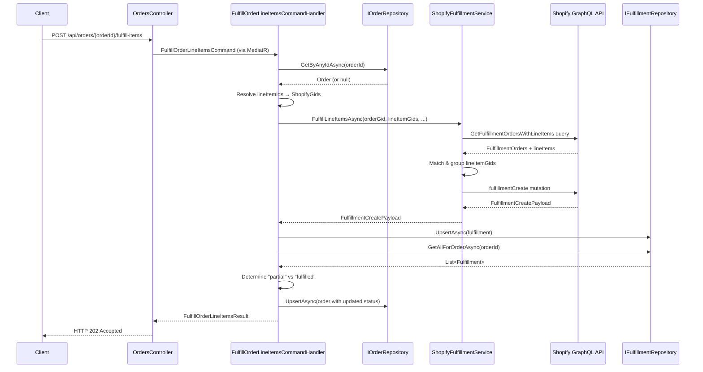

# Design Document: Partial Order Fulfillment

## Overview

This document describes the technical design for adding partial order fulfillment to the ShopifyIntegration .NET 10 application. The feature introduces a new `POST /api/orders/{orderId}/fulfill-items` endpoint that allows callers to fulfill one or more specific line items of an order, rather than all line items at once.

The design follows the existing CQRS pattern (MediatR + FluentValidation), reuses the existing `fulfillmentCreate` GraphQL mutation, and extends `ShopifyFulfillmentService` with a new `FulfillLineItemsAsync` method. The existing full-fulfillment endpoint and all webhook handlers are left entirely unchanged.

### Key Design Decisions

- **JSON column for fulfilled line item GIDs** — Rather than introducing a new `FulfillmentLineItem` join table (which would require a migration and additional repository), the `Fulfillment` entity gains a single `FulfilledLineItemGids` text column storing a JSON array of `OrderLineItem.ShopifyGid` values. This keeps the schema change minimal and avoids a new EF Core entity while still enabling accurate status determination.
- **Reuse existing `fulfillmentCreate` mutation** — Shopify's mutation already supports partial fulfillment via `lineItemsByFulfillmentOrder[].fulfillmentOrderLineItems`. No new mutation is needed.
- **New GraphQL query for fulfillment orders with line items** — The existing `GetFulfillmentOrders` query does not include `lineItems` edges. A new query constant `GetFulfillmentOrdersWithLineItems` is added to `FulfillmentQueries.cs` to retrieve the additional data needed for line item matching.
- **Flexible ID resolution** — Line item IDs are resolved using the same multi-format strategy already used for order IDs: local int PK first, then `NumericId`, then `ShopifyGid` prefix detection.

---

## Architecture

The feature follows the existing layered architecture:

```
HTTP Request
    │
    ▼
OrdersController  (API layer)
    │  POST /api/orders/{orderId}/fulfill-items
    │  [FromBody] PartialFulfillmentRequest
    │
    ▼
FulfillOrderLineItemsCommand  (CQRS command)
    │
    ▼
FulfillOrderLineItemsCommandValidator  (FluentValidation)
    │
    ▼
FulfillOrderLineItemsCommandHandler  (MediatR handler)
    │
    ├── IOrderRepository.GetByAnyIdAsync()       → resolve order GID
    ├── Line item ID resolution loop             → resolve OrderLineItem.ShopifyGid values
    ├── IShopifyFulfillmentService.FulfillLineItemsAsync()
    │       │
    │       ├── GraphQL: GetFulfillmentOrdersWithLineItems  → fetch FulfillmentOrders + lineItems
    │       ├── Match lineItemGids → FulfillmentOrderLineItem GIDs
    │       ├── Group by FulfillmentOrder GID
    │       └── GraphQL: fulfillmentCreate mutation
    │
    ├── IFulfillmentRepository.UpsertAsync()     → persist Fulfillment entity
    ├── IFulfillmentRepository.GetAllForOrderAsync() → reload for status determination
    └── IOrderRepository.UpsertAsync()           → update Order.FulfillmentStatus
```

### Sequence Diagram



---

## Components and Interfaces

### 1. `PartialFulfillmentRequest` DTO

**File:** `DTOs/PartialFulfillmentRequest.cs`

```csharp
public sealed class PartialFulfillmentRequest
{
    public List<string> LineItemIds     { get; set; } = [];
    public string?      TrackingNumber  { get; set; }
    public string?      TrackingCompany { get; set; }
    public bool         NotifyCustomer  { get; set; } = true;
}
```

### 2. `FulfillOrderLineItemsCommand` and `FulfillOrderLineItemsResult`

**File:** `Features/Orders/Commands/FulfillOrderLineItemsCommand.cs`

```csharp
public sealed record FulfillOrderLineItemsCommand(
    string       OrderId,
    List<string> LineItemIds,
    string?      TrackingNumber  = null,
    string?      TrackingCompany = null,
    bool         NotifyCustomer  = true)
    : IRequest<FulfillOrderLineItemsResult>;

public sealed record FulfillOrderLineItemsResult(
    string  OrderGid,
    string  FulfillmentGid,
    string  Status,
    string? TrackingNumber,
    string? TrackingCompany,
    string? TrackingUrl);
```

### 3. `FulfillOrderLineItemsCommandValidator`

**File:** `Features/Orders/Commands/FulfillOrderLineItemsCommandValidator.cs`

Validates:
- `OrderId` — `NotEmpty()`
- `LineItemIds` — `NotNull()`, `NotEmpty()`
- `LineItemIds` each entry — `Must(id => !string.IsNullOrWhiteSpace(id))`

### 4. `FulfillOrderLineItemsCommandHandler`

**File:** `Features/Orders/Commands/FulfillOrderLineItemsCommandHandler.cs`

Dependencies: `IOrderRepository`, `IFulfillmentRepository`, `IShopifyFulfillmentService`, `ILogger<FulfillOrderLineItemsCommandHandler>`

Responsibilities:
1. Resolve order GID via `_orders.GetByAnyIdAsync`, with numeric/raw GID fallback (same pattern as `FulfillOrderCommandHandler`).
2. For each `lineItemId` in the command, resolve to `OrderLineItem.ShopifyGid`:
   - If parseable as integer: match `OrderLineItem.Id` first, then `OrderLineItem.NumericId`.
   - If starts with `gid://shopify/`: match `OrderLineItem.ShopifyGid`.
   - Otherwise: attempt numeric parse, then treat as raw GID.
   - Unresolved IDs: log warning, continue.
3. If no IDs resolved: throw `ShopifyFulfillmentException`.
4. Call `_shopifyFulfillment.FulfillLineItemsAsync(orderGid, resolvedGids, ...)`.
5. Persist `Fulfillment` entity with `FulfilledLineItemGids` set to JSON-serialized resolved GIDs.
6. Reload all fulfillments via `_fulfillments.GetAllForOrderAsync`.
7. Determine status: collect all fulfilled GIDs across all fulfillment records, compare distinct count against `order.LineItems.Count`.
8. Update `Order.FulfillmentStatus` and `Order.UpdatedAt`.
9. Return `FulfillOrderLineItemsResult`.

### 5. `IShopifyFulfillmentService` — new method

**File:** `Infrastructure/Shopify/IShopifyFulfillmentService.cs`

```csharp
Task<FulfillmentCreatePayload> FulfillLineItemsAsync(
    string       orderGid,
    List<string> lineItemGids,
    string?      trackingNumber  = null,
    string?      trackingCompany = null,
    bool         notifyCustomer  = true,
    CancellationToken ct         = default);
```

### 6. `ShopifyFulfillmentService.FulfillLineItemsAsync`

**File:** `Infrastructure/Shopify/ShopifyFulfillmentService.cs`

Steps:
1. Execute `GetFulfillmentOrdersWithLineItems` query with `orderId` variable.
2. Filter FulfillmentOrders to `OPEN` or `IN_PROGRESS` status.
3. For each FulfillmentOrderLineItem edge, check if `lineItem.id` is in the requested `lineItemGids` set.
4. Group matched FulfillmentOrderLineItem GIDs by parent FulfillmentOrder GID.
5. If no matches: throw `ShopifyFulfillmentException`.
6. Build `lineItemsByFulfillmentOrder` input: each entry has `fulfillmentOrderId` AND `fulfillmentOrderLineItems: [{ id }]`.
7. Call `fulfillmentCreate` mutation (reusing existing `FulfillmentMutations.FulfillmentCreate`).
8. Handle `userErrors` same as `FulfillOrderAsync`.

### 7. GraphQL Query — `GetFulfillmentOrdersWithLineItems`

**File:** `GraphQL/Queries/FulfillmentQueries.cs` (new constant added to existing static class)

```graphql
query getFulfillmentOrdersWithLineItems($orderId: ID!) {
  order(id: $orderId) {
    fulfillmentOrders(first: 10) {
      edges {
        node {
          id
          status
          lineItems {
            edges {
              node {
                id
                lineItem {
                  id
                }
              }
            }
          }
        }
      }
    }
  }
}
```

### 8. GraphQL Response Models

**File:** `GraphQL/Responses/Fulfillment/GetFulfillmentOrdersWithLineItemsResponse.cs`

New classes extending the existing response hierarchy:

```csharp
public class GetFulfillmentOrdersWithLineItemsResponse
{
    public ShopifyOrderWithLineItemsNode? Order { get; set; }
}

public class ShopifyOrderWithLineItemsNode
{
    public ShopifyFulfillmentOrderWithLineItemsConnection? FulfillmentOrders { get; set; }
}

public class ShopifyFulfillmentOrderWithLineItemsConnection
{
    public List<ShopifyFulfillmentOrderWithLineItemsEdge>? Edges { get; set; }
}

public class ShopifyFulfillmentOrderWithLineItemsEdge
{
    public ShopifyFulfillmentOrderWithLineItemsNode? Node { get; set; }
}

public class ShopifyFulfillmentOrderWithLineItemsNode
{
    public string?                                    Id        { get; set; }
    public string?                                    Status    { get; set; }
    public ShopifyFulfillmentOrderLineItemConnection? LineItems { get; set; }
}

public class ShopifyFulfillmentOrderLineItemConnection
{
    public List<ShopifyFulfillmentOrderLineItemEdge>? Edges { get; set; }
}

public class ShopifyFulfillmentOrderLineItemEdge
{
    public ShopifyFulfillmentOrderLineItemNode? Node { get; set; }
}

public class ShopifyFulfillmentOrderLineItemNode
{
    public string?                    Id       { get; set; }  // FulfillmentOrderLineItem GID
    public ShopifyLineItemReference?  LineItem { get; set; }
}

public class ShopifyLineItemReference
{
    public string? Id { get; set; }  // OrderLineItem GID (matches OrderLineItem.ShopifyGid)
}
```

### 9. `OrdersController` — new endpoint

**File:** `API/Controllers/OrdersController.cs`

```csharp
[HttpPost("{orderId}/fulfill-items")]
public async Task<IActionResult> FulfillOrderLineItems(
    string orderId,
    [FromBody] PartialFulfillmentRequest request,
    CancellationToken ct = default)
{
    var command = new FulfillOrderLineItemsCommand(
        orderId,
        request.LineItemIds,
        request.TrackingNumber,
        request.TrackingCompany,
        request.NotifyCustomer);
    var result = await _mediator.Send(command, ct);
    return Accepted(result);
}
```

### 10. `Fulfillment` entity — schema change

**File:** `Domain/Entities/Fulfillment.cs`

Add one property:

```csharp
public string? FulfilledLineItemGids { get; set; }  // JSON array of OrderLineItem ShopifyGids
```

**File:** `Infrastructure/Data/Configurations/FulfillmentConfiguration.cs`

Add one mapping:

```csharp
builder.Property(f => f.FulfilledLineItemGids).HasColumnName("fulfilled_line_item_gids");
```

An EF Core migration is required to add the `fulfilled_line_item_gids` nullable text column to the `fulfillments` table.

---

## Data Models

### `Fulfillment` entity (modified)

| Column | Type | Notes |
|---|---|---|
| `id` | int | PK, identity |
| `shopify_gid` | text | unique, not null |
| `numeric_id` | bigint | not null |
| `order_id` | int | FK → orders.id |
| `status` | text | not null |
| `tracking_number` | text | nullable |
| `tracking_company` | text | nullable |
| `tracking_url` | text | nullable |
| `fulfillment_order_gid` | text | nullable |
| `fulfilled_line_item_gids` | text | nullable — JSON array, e.g. `["gid://shopify/LineItem/1","gid://shopify/LineItem/2"]` |
| `created_at` | timestamptz | not null |
| `updated_at` | timestamptz | not null |

### Status Determination Logic

After upserting the new `Fulfillment` record, the handler:

1. Calls `_fulfillments.GetAllForOrderAsync(order.Id)` to get all fulfillment records for the order.
2. Deserializes `FulfilledLineItemGids` from each record and collects all GIDs into a `HashSet<string>`.
3. Compares `fulfilledGids.Count` against `order.LineItems.Count` (the `LineItems` navigation property must be loaded — the handler loads the order via `GetByAnyIdAsync` which should include line items, or a separate query is made).
4. If `fulfilledGids.Count >= order.LineItems.Count` → `"fulfilled"`.
5. Otherwise → `"partial"`.

> **Note on line item loading**: `IOrderRepository.GetByAnyIdAsync` must include the `LineItems` navigation property (via `.Include(o => o.LineItems)`) for the count comparison to work. The existing implementation should be verified; if it does not include line items, the handler can fall back to a direct count query or the repository method can be extended.

### `FulfillOrderLineItemsCommand` data flow

```
PartialFulfillmentRequest (HTTP body)
    └── lineItemIds: ["123", "456789012", "gid://shopify/LineItem/789"]
    └── trackingNumber: "1Z999AA10123456784"
    └── trackingCompany: "UPS"
    └── notifyCustomer: true

FulfillOrderLineItemsCommand
    └── OrderId: "1001" (from path)
    └── LineItemIds: ["123", "456789012", "gid://shopify/LineItem/789"]
    └── TrackingNumber, TrackingCompany, NotifyCustomer

Handler resolves:
    └── "123"                          → OrderLineItem.Id = 123 → ShopifyGid = "gid://shopify/LineItem/111"
    └── "456789012"                    → OrderLineItem.NumericId = 456789012 → ShopifyGid = "gid://shopify/LineItem/222"
    └── "gid://shopify/LineItem/789"   → OrderLineItem.ShopifyGid match → ShopifyGid = "gid://shopify/LineItem/789"

FulfillLineItemsAsync receives:
    └── orderGid: "gid://shopify/Order/9999"
    └── lineItemGids: ["gid://shopify/LineItem/111", "gid://shopify/LineItem/222", "gid://shopify/LineItem/789"]

Shopify FulfillmentOrder mapping:
    └── FulfillmentOrder A (gid://shopify/FulfillmentOrder/100):
        └── FulfillmentOrderLineItem X → lineItem.id = "gid://shopify/LineItem/111" ✓
        └── FulfillmentOrderLineItem Y → lineItem.id = "gid://shopify/LineItem/222" ✓
    └── FulfillmentOrder B (gid://shopify/FulfillmentOrder/200):
        └── FulfillmentOrderLineItem Z → lineItem.id = "gid://shopify/LineItem/789" ✓

lineItemsByFulfillmentOrder input:
    └── { fulfillmentOrderId: "...100", fulfillmentOrderLineItems: [{ id: "...X" }, { id: "...Y" }] }
    └── { fulfillmentOrderId: "...200", fulfillmentOrderLineItems: [{ id: "...Z" }] }
```

---

## Correctness Properties

*A property is a characteristic or behavior that should hold true across all valid executions of a system — essentially, a formal statement about what the system should do. Properties serve as the bridge between human-readable specifications and machine-verifiable correctness guarantees.*

#### Redundancy Analysis

Before writing properties, reviewing the prework for redundancy:

- Requirements 5.3, 5.4, 6.3, and 6.4 all describe the same status determination logic from different angles. They are consolidated into a single property (Property 4) covering the full range of inputs.
- Requirements 4.3 and 4.4 describe two steps of the same mapping pipeline (match then group). They are consolidated into Property 3.
- Requirements 2.5 and 2.7 both describe validator rejection of whitespace inputs. They are consolidated into Property 2.
- Requirements 7.1 and 7.3 both describe result field population. They are consolidated into Property 5.
- Requirements 5.2 and 7.1 overlap on field mapping from Shopify response to local entity/result. Property 5 covers both.

---

### Property 1: Order ID resolution handles all supported formats

*For any* `orderId` string that is a valid local integer, a Shopify numeric ID string, or a Shopify GID string (`gid://shopify/Order/{n}`), the handler SHALL resolve it to the correct Shopify order GID without throwing an exception.

**Validates: Requirements 1.2, 3.1, 3.2**

---

### Property 2: Validator rejects all whitespace-only inputs

*For any* `FulfillOrderLineItemsCommand` where `OrderId` is a string composed entirely of whitespace characters, OR where any entry in `LineItemIds` is a string composed entirely of whitespace characters, the validator SHALL return a validation failure and the command SHALL NOT be dispatched to the handler.

**Validates: Requirements 2.5, 2.7**

---

### Property 3: Line item GID matching and grouping preserves all requested items

*For any* set of requested `lineItemGids` and any set of `FulfillmentOrder` structures returned by Shopify, every requested GID that appears as a `lineItem { id }` in any `FulfillmentOrderLineItem` SHALL appear exactly once in the resulting `lineItemsByFulfillmentOrder` input, grouped under the correct parent `FulfillmentOrder` GID.

**Validates: Requirements 4.3, 4.4**

---

### Property 4: Fulfillment status determination is correct for all line item coverage ratios

*For any* order with N ≥ 1 line items and any set of M distinct fulfilled `OrderLineItem` ShopifyGids stored across all `Fulfillment` records for that order:
- If M ≥ N, `Order.FulfillmentStatus` SHALL be set to `"fulfilled"`.
- If M < N, `Order.FulfillmentStatus` SHALL be set to `"partial"`.

**Validates: Requirements 5.3, 5.4, 6.2, 6.3, 6.4**

---

### Property 5: Result and entity fields are fully populated from Shopify response

*For any* `ShopifyFulfillmentNode` returned by Shopify with a non-null `Id`, the `FulfillOrderLineItemsResult` returned by the handler SHALL contain `OrderGid`, `FulfillmentGid` equal to `shopifyFulfillment.Id`, `Status`, and the `Number`, `Company`, and `Url` from the **first** entry of `TrackingInfo` (or null if `TrackingInfo` is empty).

**Validates: Requirements 7.1, 7.3**

---

## Error Handling

### Validation errors (HTTP 400)

FluentValidation pipeline behavior (already configured via MediatR pipeline) returns 400 with field-level error details when `FulfillOrderLineItemsCommandValidator` fails. No additional controller-level handling is needed.

### Unresolvable line item IDs

When a `lineItemId` cannot be matched to any `OrderLineItem`:
- Log a warning including the unresolvable ID value.
- Continue processing remaining IDs.
- If **all** IDs are unresolvable after the loop, throw `ShopifyFulfillmentException(["No line items could be resolved to known OrderLineItems."])`.

### No matching FulfillmentOrder line items

When `FulfillLineItemsAsync` finds no `FulfillmentOrderLineItem` matching any requested GID:
- Throw `ShopifyFulfillmentException(["None of the requested line items were found in any open fulfillment order."])`.
- The `fulfillmentCreate` mutation is NOT called.

### Shopify `userErrors`

Same handling as `FulfillOrderAsync`: collect error messages, log a warning, throw `ShopifyFulfillmentException(messages)`.

### Order not found locally

When `GetByAnyIdAsync` returns null:
- Log a warning with the `OrderId` value.
- Skip local persistence (no `UpsertAsync` calls).
- Still return the `FulfillOrderLineItemsResult` from the Shopify response.
- Database connection failures and other infrastructure exceptions propagate normally.

### GlobalExceptionMiddleware

The existing middleware handles `ShopifyFulfillmentException` and maps it to an appropriate HTTP error response. No changes needed.

---

## Testing Strategy

### Unit Tests

Unit tests cover specific examples, edge cases, and error conditions using mocked dependencies.

**`FulfillOrderLineItemsCommandValidatorTests`**
- Valid command passes validation.
- Empty `OrderId` fails validation.
- Null `LineItemIds` fails validation.
- Empty `LineItemIds` list fails validation.
- `LineItemIds` with one blank entry fails validation.
- `LineItemIds` with all valid entries passes validation.

**`FulfillOrderLineItemsCommandHandlerTests`**
- Happy path: all IDs resolve, Shopify returns success, fulfillment persisted, status updated.
- Order not found locally: warning logged, no persistence, result still returned.
- All line item IDs unresolvable: `ShopifyFulfillmentException` thrown.
- Mixed resolvable/unresolvable IDs: warning logged for unresolvable, processing continues.
- Status set to `"partial"` when not all line items fulfilled.
- Status set to `"fulfilled"` when all line items fulfilled.
- Tracking info: first entry used when list has multiple entries.
- `GetAllForOrderAsync` called after `UpsertAsync` (sequencing verified via mock call order).

**`ShopifyFulfillmentServiceTests`** (for `FulfillLineItemsAsync`)
- Correct GraphQL query sent with order GID variable.
- Line items matched correctly across multiple FulfillmentOrders.
- Grouping produces correct `lineItemsByFulfillmentOrder` structure.
- No matching line items throws `ShopifyFulfillmentException` without calling mutation.
- Shopify `userErrors` throws `ShopifyFulfillmentException`.
- Successful mutation returns `FulfillmentCreatePayload`.

### Property-Based Tests

Property-based tests use a PBT library appropriate for .NET. The recommended library is **FsCheck** (via `FsCheck.Xunit` or `FsCheck.NUnit`), which is the standard PBT library in the .NET ecosystem. Each property test runs a minimum of **100 iterations**.

Each test is tagged with a comment in the format:
`// Feature: partial-order-fulfillment, Property {N}: {property_text}`

**Property 1 — Order ID resolution handles all supported formats**
Generate random `orderId` values in three formats (random positive int as string, random positive long as string, random `gid://shopify/Order/{n}` string). For each, verify the handler resolves to a non-null, non-empty order GID string without throwing.
`// Feature: partial-order-fulfillment, Property 1: Order ID resolution handles all supported formats`

**Property 2 — Validator rejects all whitespace-only inputs**
Generate random strings composed entirely of whitespace characters (spaces, tabs, newlines). Verify `FulfillOrderLineItemsCommandValidator` returns `IsValid = false` for commands with whitespace `OrderId` or any whitespace entry in `LineItemIds`.
`// Feature: partial-order-fulfillment, Property 2: Validator rejects all whitespace-only inputs`

**Property 3 — Line item GID matching and grouping preserves all requested items**
Generate random sets of `lineItemGids` (valid GID strings) and random `FulfillmentOrder` structures where some FulfillmentOrderLineItems reference those GIDs. Verify that the matching and grouping logic in `ShopifyFulfillmentService` produces a `lineItemsByFulfillmentOrder` list where every matched GID appears exactly once under the correct FulfillmentOrder.
`// Feature: partial-order-fulfillment, Property 3: Line item GID matching and grouping preserves all requested items`

**Property 4 — Fulfillment status determination is correct for all line item coverage ratios**
Generate random orders with N (1..20) line items and M (0..N) distinct fulfilled GIDs stored across fulfillment records. Verify the status determination logic produces `"fulfilled"` when M ≥ N and `"partial"` when M < N.
`// Feature: partial-order-fulfillment, Property 4: Fulfillment status determination is correct for all line item coverage ratios`

**Property 5 — Result and entity fields are fully populated from Shopify response**
Generate random `ShopifyFulfillmentNode` instances with varying `Id`, `Status`, and `TrackingInfo` list lengths (0..5). Verify the handler maps all fields correctly to `FulfillOrderLineItemsResult`, using the first `TrackingInfo` entry when present and null otherwise.
`// Feature: partial-order-fulfillment, Property 5: Result and entity fields are fully populated from Shopify response`

### Integration Tests

Integration tests verify end-to-end wiring with a real (or test-double) database and mocked Shopify GraphQL responses.

- `POST /api/orders/{orderId}/fulfill-items` returns 202 with valid request.
- `POST /api/orders/{orderId}/fulfill-items` returns 400 with missing `lineItemIds`.
- `POST /api/orders/{orderId}/fulfill` (existing endpoint) continues to return 202 — non-regression.
- Both endpoints route independently when called in the same session.
- Fulfillment record is persisted with correct `FulfilledLineItemGids` JSON after a successful call.
- `Order.FulfillmentStatus` is `"partial"` after fulfilling a subset of line items.
- `Order.FulfillmentStatus` is `"fulfilled"` after fulfilling all line items.
