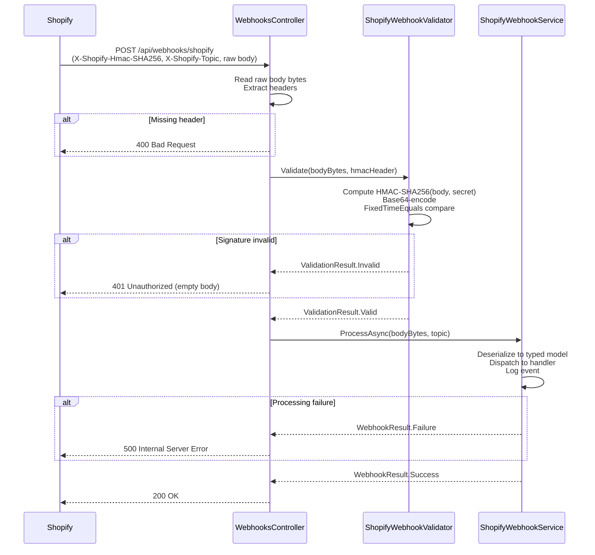

# Design Document: Shopify Webhooks HMAC

## Overview

This feature adds inbound Shopify webhook support to the existing .NET 10 ASP.NET Core Web API. The system receives HTTP POST requests from Shopify for product lifecycle events (`products/create`, `products/update`, `products/delete`), verifies each request's authenticity using HMAC-SHA256 signature validation, and dispatches the validated payload to the appropriate handler.

The design follows the existing project conventions: `IOptions<T>` for configuration, scoped services registered in `Program.cs`, `[ApiController]` controllers, and `Newtonsoft.Json` for JSON serialization (already a project dependency).

### Key Design Decisions

- **Raw body reading before model binding**: The controller reads the raw `byte[]` body via `HttpContext.Request.Body` before any ASP.NET Core model binding occurs. This is required because HMAC validation must operate on the exact bytes Shopify signed — model binding would consume the stream and potentially alter encoding.
- **Constant-time comparison**: `System.Security.Cryptography.CryptographicOperations.FixedTimeEquals` is used for signature comparison to prevent timing-based side-channel attacks.
- **Result objects over exceptions**: `ShopifyWebhookValidator` and `ShopifyWebhookService` return lightweight result types rather than throwing exceptions, keeping the controller logic clean and predictable.
- **No new NuGet packages required**: HMAC-SHA256 is available in `System.Security.Cryptography` (BCL). `Newtonsoft.Json` is already referenced. No additional dependencies are needed.

---

## Architecture



### Component Responsibilities

| Component | Responsibility |
|---|---|
| `WebhooksController` | Route, header extraction, orchestration, HTTP response mapping |
| `ShopifyWebhookValidator` | HMAC-SHA256 computation, Base64 encoding, constant-time comparison |
| `ShopifyWebhookService` | Topic dispatch, JSON deserialization, event logging |
| Webhook models | Strongly-typed payload representations |
| `ShopifySettings` | Configuration carrier (extended with `WebhookSecret`) |

---

## Components and Interfaces

### IShopifyWebhookValidator

```csharp
namespace ShopifyIntegration.Webhooks.Validators;

public interface IShopifyWebhookValidator
{
    /// <summary>
    /// Validates the HMAC-SHA256 signature of an incoming Shopify webhook request.
    /// </summary>
    /// <param name="rawBody">The raw request body bytes exactly as received.</param>
    /// <param name="hmacHeader">The Base64-encoded HMAC value from X-Shopify-Hmac-SHA256.</param>
    /// <returns>A <see cref="ValidationResult"/> indicating whether the request is authentic.</returns>
    ValidationResult Validate(byte[] rawBody, string hmacHeader);
}

public sealed record ValidationResult(bool IsValid)
{
    public static readonly ValidationResult Valid   = new(true);
    public static readonly ValidationResult Invalid = new(false);
}
```

### IShopifyWebhookService

```csharp
namespace ShopifyIntegration.Webhooks.Services;

public interface IShopifyWebhookService
{
    /// <summary>
    /// Processes a validated Shopify webhook payload.
    /// </summary>
    /// <param name="rawBody">The raw request body bytes.</param>
    /// <param name="topic">The value of the X-Shopify-Topic header (e.g. "products/create").</param>
    Task<WebhookResult> ProcessAsync(byte[] rawBody, string topic);
}

public sealed record WebhookResult(bool IsSuccess, string? ErrorMessage = null)
{
    public static readonly WebhookResult Success = new(true);
    public static WebhookResult Failure(string error) => new(false, error);
}
```

### ShopifyWebhookValidator

```csharp
namespace ShopifyIntegration.Webhooks.Validators;

public sealed class ShopifyWebhookValidator : IShopifyWebhookValidator
{
    private readonly ShopifySettings _settings;

    public ShopifyWebhookValidator(IOptions<ShopifySettings> options)
    {
        _settings = options.Value;
    }

    public ValidationResult Validate(byte[] rawBody, string hmacHeader)
    {
        // Guard: empty secret or empty body → invalid
        if (string.IsNullOrEmpty(_settings.WebhookSecret)) return ValidationResult.Invalid;
        if (rawBody.Length == 0) return ValidationResult.Invalid;

        // Compute HMAC-SHA256
        var keyBytes = Encoding.UTF8.GetBytes(_settings.WebhookSecret);
        using var hmac = new HMACSHA256(keyBytes);
        var digest = hmac.ComputeHash(rawBody);
        var expected = Convert.ToBase64String(digest);

        // Decode the incoming header value for byte-level comparison
        byte[] expectedBytes;
        byte[] actualBytes;
        try
        {
            expectedBytes = Convert.FromBase64String(expected);
            actualBytes   = Convert.FromBase64String(hmacHeader);
        }
        catch (FormatException)
        {
            return ValidationResult.Invalid;
        }

        // Constant-time comparison
        return CryptographicOperations.FixedTimeEquals(expectedBytes, actualBytes)
            ? ValidationResult.Valid
            : ValidationResult.Invalid;
    }
}
```

### ShopifyWebhookService

```csharp
namespace ShopifyIntegration.Webhooks.Services;

public sealed class ShopifyWebhookService : IShopifyWebhookService
{
    private readonly ILogger<ShopifyWebhookService> _logger;

    public ShopifyWebhookService(ILogger<ShopifyWebhookService> logger)
    {
        _logger = logger;
    }

    public async Task<WebhookResult> ProcessAsync(byte[] rawBody, string topic)
    {
        try
        {
            var json = Encoding.UTF8.GetString(rawBody);
            return topic switch
            {
                "products/create" => HandleCreate(json),
                "products/update" => HandleUpdate(json),
                "products/delete" => HandleDelete(json),
                _                 => HandleUnknown(topic)
            };
        }
        catch (Exception ex)
        {
            _logger.LogError(ex, "Unhandled exception processing webhook topic {Topic}", topic);
            return WebhookResult.Failure(ex.Message);
        }
    }

    private WebhookResult HandleCreate(string json) { /* deserialize + log */ }
    private WebhookResult HandleUpdate(string json) { /* deserialize + log */ }
    private WebhookResult HandleDelete(string json) { /* deserialize + log */ }
    private WebhookResult HandleUnknown(string topic) { /* log + return success */ }
}
```

### WebhooksController

```csharp
namespace ShopifyIntegration.Controllers;

[ApiController]
[Route("api/webhooks")]
public sealed class WebhooksController : ControllerBase
{
    private readonly IShopifyWebhookValidator _validator;
    private readonly IShopifyWebhookService   _service;

    public WebhooksController(
        IShopifyWebhookValidator validator,
        IShopifyWebhookService service)
    {
        _validator = validator;
        _service   = service;
    }

    [HttpPost("shopify")]
    public async Task<IActionResult> ReceiveShopifyWebhook()
    {
        // 1. Extract headers
        if (!Request.Headers.TryGetValue("X-Shopify-Hmac-SHA256", out var hmacValues) ||
            string.IsNullOrEmpty(hmacValues))
            return BadRequest();

        if (!Request.Headers.TryGetValue("X-Shopify-Topic", out var topicValues) ||
            string.IsNullOrEmpty(topicValues))
            return BadRequest();

        var hmacHeader = hmacValues.ToString();
        var topic      = topicValues.ToString();

        // 2. Read raw body
        using var ms = new MemoryStream();
        await Request.Body.CopyToAsync(ms);
        var rawBody = ms.ToArray();

        // 3. Validate HMAC
        var validation = _validator.Validate(rawBody, hmacHeader);
        if (!validation.IsValid)
            return Unauthorized();

        // 4. Process
        var result = await _service.ProcessAsync(rawBody, topic);
        return result.IsSuccess ? Ok() : StatusCode(500);
    }
}
```

---

## Data Models

### ShopifySettings (extended)

```csharp
namespace ShopifyIntegration.Models;

public class ShopifySettings
{
    public string StoreUrl      { get; set; } = string.Empty;
    public string AccessToken   { get; set; } = string.Empty;
    public string ApiVersion    { get; set; } = string.Empty;
    public string WebhookSecret { get; set; } = string.Empty;  // NEW
}
```

Configuration key: `Shopify:WebhookSecret`. When absent, the property defaults to an empty string, which the validator treats as invalid.

### ProductCreatedWebhook

```csharp
namespace ShopifyIntegration.Webhooks.Models.Products;

public sealed class ProductCreatedWebhook
{
    [JsonProperty("id")]
    public long Id { get; set; }

    [JsonProperty("title")]
    public string Title { get; set; } = string.Empty;

    [JsonProperty("vendor")]
    public string Vendor { get; set; } = string.Empty;

    [JsonProperty("status")]
    public string Status { get; set; } = string.Empty;

    [JsonProperty("updated_at")]
    public DateTimeOffset UpdatedAt { get; set; }
}
```

### ProductUpdatedWebhook

Identical field set to `ProductCreatedWebhook` — same fields, separate type for clarity and future divergence.

```csharp
namespace ShopifyIntegration.Webhooks.Models.Products;

public sealed class ProductUpdatedWebhook
{
    [JsonProperty("id")]
    public long Id { get; set; }

    [JsonProperty("title")]
    public string Title { get; set; } = string.Empty;

    [JsonProperty("vendor")]
    public string Vendor { get; set; } = string.Empty;

    [JsonProperty("status")]
    public string Status { get; set; } = string.Empty;

    [JsonProperty("updated_at")]
    public DateTimeOffset UpdatedAt { get; set; }
}
```

### ProductDeletedWebhook

```csharp
namespace ShopifyIntegration.Webhooks.Models.Products;

public sealed class ProductDeletedWebhook
{
    [JsonProperty("id")]
    public long Id { get; set; }
}
```

### JSON Serialization Notes

The project already uses `Newtonsoft.Json` (v13.0.4). All webhook models use `[JsonProperty]` attributes to map Shopify's snake_case field names to PascalCase C# properties. Deserialization uses `JsonConvert.DeserializeObject<T>()`.

---

## Correctness Properties

*A property is a characteristic or behavior that should hold true across all valid executions of a system — essentially, a formal statement about what the system should do. Properties serve as the bridge between human-readable specifications and machine-verifiable correctness guarantees.*

### Property 1: HMAC Signature Round-Trip

*For any* non-empty byte array as the request body and any non-empty string as the webhook secret, computing the HMAC-SHA256 signature of the body with that secret and then validating the resulting signature against the same body and secret SHALL produce a valid result.

**Validates: Requirements 2.1, 2.2, 2.4, 2.8**

### Property 2: Tampered Signature Is Always Rejected

*For any* non-empty byte array as the request body, any non-empty webhook secret, and any signature string that differs from the correctly computed signature, the validator SHALL return an invalid result.

**Validates: Requirements 2.5**

### Property 3: Webhook Model Deserialization Round-Trip

*For any* valid `ProductCreatedWebhook`, `ProductUpdatedWebhook`, or `ProductDeletedWebhook` instance with arbitrary field values, serializing the model to JSON and deserializing it back SHALL produce an equivalent model with all required fields preserved.

**Validates: Requirements 4.1, 4.2, 4.3, 4.5, 4.6, 4.7**

---

## Error Handling

### Missing Headers → 400 Bad Request

The controller checks for the presence of `X-Shopify-Hmac-SHA256` and `X-Shopify-Topic` before any further processing. Missing or empty headers return `400 Bad Request` immediately. No body is included in the response.

### Invalid HMAC → 401 Unauthorized

When `ShopifyWebhookValidator.Validate` returns `ValidationResult.Invalid`, the controller returns `401 Unauthorized` with an empty response body. The reason for rejection (missing secret, empty body, signature mismatch) is intentionally not disclosed to the caller.

### Deserialization Failure → 500 Internal Server Error

When `JsonConvert.DeserializeObject<T>()` throws or returns null, `ShopifyWebhookService` catches the exception, logs it via `ILogger` at `Error` level (including the topic and exception details), and returns `WebhookResult.Failure(...)`. The controller maps this to `500 Internal Server Error`.

### Unknown Topic → 200 OK (logged)

An unrecognized topic is not an error from Shopify's perspective — Shopify expects a `2xx` response to acknowledge receipt. The service logs the unrecognized topic at `Warning` level and returns `WebhookResult.Success`.

### Missing WebhookSecret Configuration

When `Shopify:WebhookSecret` is absent from configuration, `ShopifySettings.WebhookSecret` defaults to an empty string. The validator treats an empty secret as invalid and returns `ValidationResult.Invalid`, causing all requests to be rejected with `401 Unauthorized`. This is a safe-by-default behavior.

---

## Testing Strategy

### Dual Testing Approach

Unit tests cover specific examples, edge cases, and error conditions. Property-based tests verify universal properties across all inputs. Both are complementary.

### Property-Based Testing

The project already uses **FsCheck 2.16.6** with **FsCheck.Xunit** (confirmed in `ShopifyIntegration.Tests.csproj`). Property tests are implemented using `[Property]` attributes with `MaxTest = 100` (minimum).

**Property 1 — HMAC Round-Trip** (`Feature: shopify-webhooks-hmac, Property 1: HMAC signature round-trip`)
- Generator: `NonEmptyArray<byte>` for body, `NonEmptyString` for secret
- Action: Compute signature via `ShopifyWebhookValidator`, then call `Validate` with the computed signature
- Assertion: `ValidationResult.IsValid == true`

**Property 2 — Tampered Signature Rejected** (`Feature: shopify-webhooks-hmac, Property 2: Tampered signature is always rejected`)
- Generator: `NonEmptyArray<byte>` for body, `NonEmptyString` for secret, `NonEmptyString` for tampered signature (filtered to exclude the correct signature)
- Action: Call `Validate` with the tampered signature
- Assertion: `ValidationResult.IsValid == false`

**Property 3 — Model Deserialization Round-Trip** (`Feature: shopify-webhooks-hmac, Property 3: Webhook model deserialization round-trip`)
- Generator: Arbitrary `ProductCreatedWebhook`, `ProductUpdatedWebhook`, `ProductDeletedWebhook` instances with random field values
- Action: `JsonConvert.SerializeObject(model)` → `JsonConvert.DeserializeObject<T>(json)`
- Assertion: All required fields (`Id`, `Title`, `Vendor`, `Status`, `UpdatedAt`) are equal to the originals

### Unit Tests (Example-Based)

| Test | Scenario | Expected |
|---|---|---|
| Missing `X-Shopify-Hmac-SHA256` | POST without HMAC header | 400 Bad Request |
| Missing `X-Shopify-Topic` | POST without topic header | 400 Bad Request |
| Invalid HMAC | Validator returns Invalid | 401 Unauthorized, empty body, service not called |
| Valid HMAC, service success | Validator returns Valid, service returns Success | 200 OK |
| Valid HMAC, service failure | Validator returns Valid, service returns Failure | 500 Internal Server Error |
| Empty WebhookSecret | `ShopifySettings.WebhookSecret = ""` | `ValidationResult.Invalid` |
| Empty body bytes | `rawBody = byte[0]` | `ValidationResult.Invalid` |
| Malformed Base64 in HMAC header | Header contains invalid Base64 | `ValidationResult.Invalid` |
| Malformed JSON body | Invalid JSON for known topic | `WebhookResult.Failure`, error logged |
| Unknown topic | Topic = `"orders/create"` | `WebhookResult.Success`, warning logged |
| `products/create` processed | Valid create payload | Product ID and title logged |
| `products/update` processed | Valid update payload | Product ID and title logged |
| `products/delete` processed | Valid delete payload | Product ID logged |

### DI Registration Smoke Test

Verify that `WebApplication.CreateBuilder` + `Program.cs` service registrations resolve `IShopifyWebhookValidator`, `IShopifyWebhookService`, and `WebhooksController` without exceptions.

### Test File Placement

New test classes go in `ShopifyIntegration.Tests/`:
- `WebhooksControllerTests.cs` — controller unit tests (mock validator + service)
- `ShopifyWebhookValidatorTests.cs` — validator unit tests + property tests (Properties 1 & 2)
- `ShopifyWebhookServiceTests.cs` — service unit tests + property tests (Property 3)
